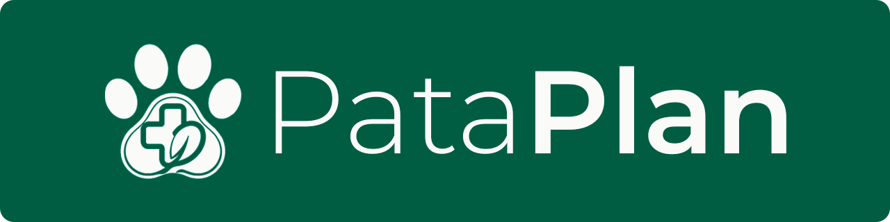

<div align="center">
  
</div>

<div align="center">

[](LICENSE)


[](CONTRIBUTING.md)
[](https://github.com/jesuuslopeez/pata-plan/actions/workflows/ci.yml)
[](https://github.com/jesuuslopeez/pata-plan/actions/workflows/deploy.yml)

</div>

<div align="center">

**Web application for managing the health, vaccination schedules, and veterinary records of multiple pets and animal shelters.**

PataPlan is a platform designed for households with multiple pets and independent shelters managing dozens of animals without depending on a specific clinic. It replaces notebooks, paper vaccination cards and ad-hoc spreadsheets with a smart health calendar, chained protocols and prioritised alerts.

🌐 **Live demo:** [pataplan.yiisus.com](https://pataplan.yiisus.com) · 📋 **Project board:** [GitHub Projects](https://github.com/users/jesuuslopeez/projects/3) · 🎨 **Design:** [Figma prototype](https://www.figma.com/design/4V8fbliz3unSknovv7lmi0/PataPlan?node-id=0-1)

</div>

---

## 📸 Screenshots

| Dashboard | Animals |
|-----------|---------|
|  |  |

| Animal profile | Expenses |
|----------------|----------|
|  |  |

More screenshots available in [`docs/assets/manual/`](docs/assets/manual/).

---

## ✨ Features

- 🐾 **Multi-animal management** organised by groups (home, shelter, etc.)
- 📅 **Smart health calendar** with automatic calculation of next doses
- 🔗 **Health protocol engine** with chained temporal dependencies
- 🚨 **Priority-based alert system** that surfaces what truly needs attention
- 📊 **"What needs attention" dashboard** instead of generic stats
- 📄 **Automatic PDF reports** generation per animal
- ⚖️ **Weight anomaly detection** based on statistical thresholds
- 💰 **Veterinary expense tracking** with monthly and per-animal stats
- 📎 **Document management** (vaccination cards, lab results, vet reports)
- 👥 **Role system** (Admin / Collaborator) with shareable group codes
- 📱 **Fully responsive design** (desktop, tablet, mobile)
- ♿ **Accessible UI** built to WCAG AA standards

---

## 🛠️ Tech Stack

| Category   | Technology                       |
|------------|----------------------------------|
| Frontend   | React + Vite + SASS              |
| Backend    | Node.js + Express                |
| ORM        | Prisma                           |
| Database   | PostgreSQL                       |
| Auth       | JWT with role-based access       |
| Containers | Docker + Docker Compose          |
| CI/CD      | GitHub Actions                   |
| API Docs   | Swagger / OpenAPI 3              |
| Testing    | Jest + React Testing Library     |
| Design     | Figma                            |

---

## 🚀 Getting Started

### Prerequisites

- Node.js **20+**
- Docker and Docker Compose
- Git

### Installation (recommended — Docker)

```bash
git clone https://github.com/jesuuslopeez/pata-plan.git
cd pata-plan
cp .env.example .env
docker compose -f docker-compose.yml -f docker-compose.dev.yml up
```

The frontend will be available at `http://localhost:5173` and the API at `http://localhost:3000`.

### Without Docker (manual setup)

```bash
# 1. Install PostgreSQL 16 locally and create the database
createdb pataplan

# 2. Configure environment
cp .env.example .env
# Edit DATABASE_URL so the host points to localhost (not "db")

# 3. Install dependencies and run migrations
cd server
npm install
npx prisma migrate deploy
npx prisma db seed
npm run dev

# 4. In a separate terminal, start the frontend
cd client
npm install
npm run dev
```

---

## ⚙️ Environment Variables

| Variable | Description | Default |
|----------|-------------|---------|
| `POSTGRES_USER` | PostgreSQL user | `pataplan` |
| `POSTGRES_PASSWORD` | PostgreSQL password | `change-me-in-production` |
| `POSTGRES_DB` | PostgreSQL database name | `pataplan` |
| `DATABASE_URL` | Connection string used by Prisma | `postgresql://pataplan:...@db:5432/pataplan` |
| `PORT` | Backend HTTP port | `3000` |
| `NODE_ENV` | Runtime environment | `development` |
| `JWT_SECRET` | Secret used to sign JWTs | _(required)_ |
| `JWT_EXPIRES_IN` | JWT expiration | `7d` |
| `CORS_ORIGIN` | Allowed frontend origin(s) | `http://localhost:5173` |
| `UPLOAD_MAX_SIZE_MB` | Max upload size in MB | `10` |
| `UPLOAD_DIR` | Local directory for uploads | `uploads` |
| `SMTP_HOST` | SMTP server host | `smtp.gmail.com` |
| `SMTP_PORT` | SMTP server port | `587` |
| `SMTP_SECURE` | Use TLS | `false` |
| `SMTP_USER` | SMTP username | _(required)_ |
| `SMTP_PASS` | SMTP password / app password | _(required)_ |
| `MAIL_FROM` | From header for outgoing email | `PataPlan <...>` |
| `VERIFY_URL_BASE` | Email verification link base | `http://localhost:5173/verify-email` |
| `RESET_URL_BASE` | Password reset link base | `http://localhost:5173/reset-password` |
| `NOTIFICATIONS_ENABLED` | Enable daily reminder scheduler | `true` |
| `NOTIFICATIONS_CRON` | Cron schedule for reminders | `0 9 * * *` |
| `NOTIFICATIONS_TIMEZONE` | Timezone for reminders | `Europe/Madrid` |
| `NOTIFICATIONS_TRIGGER_TOKEN` | Token to manually trigger the job | _(empty)_ |
| `VITE_API_URL` | Base URL the SPA uses to reach the API | `http://localhost:3000/api` |

See [`.env.example`](.env.example) for the full template.

---

## 📡 API Overview

Full interactive documentation is available at **`/api/docs`** (Swagger UI) once the backend is running.

| Resource         | Method & Path                              | Description                          |
|------------------|--------------------------------------------|--------------------------------------|
| Auth             | `POST /api/auth/register`                  | Create a new account                 |
| Auth             | `POST /api/auth/login`                     | Obtain a JWT                         |
| Auth             | `POST /api/auth/forgot-password`           | Request a reset link                 |
| Groups           | `GET /api/groups`                          | List the user's groups               |
| Groups           | `POST /api/groups`                         | Create a group                       |
| Animals          | `GET /api/animals`                         | List animals (with filters)          |
| Animals          | `POST /api/animals`                        | Create an animal (multipart)         |
| Animals          | `GET /api/animals/:id`                     | Animal profile                       |
| Health events    | `GET /api/animals/:id/events`              | Animal's health events               |
| Health events    | `PATCH /api/events/:id/complete`           | Mark event completed (cascade)       |
| Protocols        | `GET /api/protocols`                       | List protocols                       |
| Protocols        | `POST /api/animals/:id/assignments`        | Assign a protocol to an animal       |
| Visits           | `GET /api/animals/:id/visits`              | Vet visits                           |
| Documents        | `POST /api/animals/:id/documents`          | Upload a document                    |
| Expenses         | `GET /api/expenses`                        | List expenses                        |
| Reports          | `GET /api/animals/:id/report`              | Generate a PDF health report         |
| Dashboard        | `GET /api/dashboard`                       | Summary + prioritised alerts         |

---

## 📁 Project Structure

```
pata-plan/
├── .github/
│   └── workflows/         # CI and deploy pipelines
├── client/                # React + Vite frontend
│   ├── public/
│   └── src/
│       ├── components/    # Reusable UI components
│       ├── pages/         # Route-level views
│       ├── layouts/       # Shared layouts
│       ├── hooks/         # Custom React hooks
│       ├── services/      # API clients
│       ├── context/       # React context providers
│       ├── router/        # App routing (lazy-loaded)
│       ├── styles/        # Global SASS (BEM)
│       └── tests/         # Vitest + RTL tests
├── server/                # Node.js + Express backend
│   └── src/
│       ├── routes/        # Express routers
│       ├── controllers/   # Request handlers
│       ├── services/      # Business logic
│       ├── middlewares/   # Auth, error handling, validation
│       ├── utils/         # Helpers (Prisma client, email, PDF)
│       ├── tests/         # Jest unit and integration tests
│       └── swagger.json   # OpenAPI specification
├── prisma/
│   └── schema.prisma      # Database schema
├── docs/                  # Academic documentation + screenshots
├── docker-compose.yml
├── docker-compose.dev.yml
├── docker-compose.prod.yml
└── .env.example
```

---

## 🤝 Contributing

Contributions are welcome! Please read [CONTRIBUTING.md](CONTRIBUTING.md) for the workflow, branching strategy and commit conventions, and follow the [Code of Conduct](CODE_OF_CONDUCT.md).

---

## 📄 License

This project is licensed under the MIT License — see the [LICENSE](LICENSE) file for details.

---

## 👤 Author

**Jesús López Pérez**

- GitHub: [@jesuuslopeez](https://github.com/jesuuslopeez)
- Final project for **DAW (Web Application Development)** — IES Rafael Alberti
