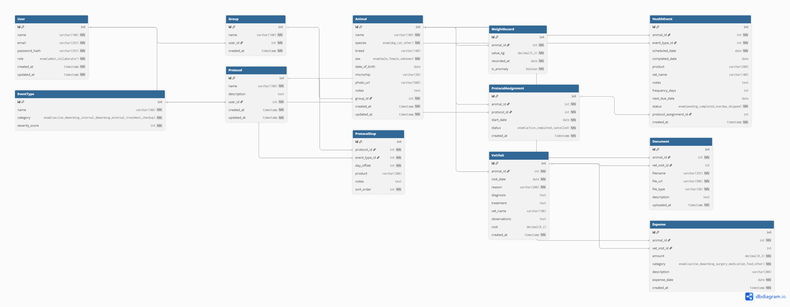

# 5. Diseño

Este documento recoge el modelo de datos, los casos de uso, los flujos críticos, la arquitectura y la API REST que sustentan PataPlan.

## 5.1. Modelo de datos (diagrama ER)



El modelo se compone de **doce entidades principales** más una entidad de catálogo (`EventType`). A continuación se describe cada una y sus relaciones más importantes.

### 5.1.1. Entidades

1. **User** — Cuenta de usuario. Guarda nombre, correo, hash de la contraseña, rol global (`ADMIN` / `COLLABORATOR`), estado de verificación de correo y tokens auxiliares (verificación, restablecimiento de contraseña). Un usuario posee `Group`s, define `Protocol`s y participa en `GroupCollaborator`s.
2. **Group** — Agrupación lógica de animales (por ejemplo "Casa" o "Refugio"). Pertenece a un único `User` (propietario) y puede tener un `inviteCode` único para invitar a colaboradores. Contiene `Animal`s y `GroupCollaborator`s.
3. **GroupCollaborator** — Relación N:N entre `User` y `Group` con un rol específico por grupo (`VIEWER` o `EDITOR`). Permite que un usuario participe en grupos de otra cuenta sin ser propietario.
4. **Animal** — Ficha del animal: nombre, especie, raza, sexo, fecha de nacimiento, microchip, foto, notas. Pertenece a un `Group` y agrupa todo el resto de información (peso, eventos, visitas, documentos, gastos, asignaciones de protocolo).
5. **WeightRecord** — Registro puntual de peso de un `Animal` con fecha y bandera `isAnomaly` cuando el sistema detecta una desviación significativa.
6. **HealthEvent** — Evento sanitario: vacuna, desparasitación, revisión o tratamiento. Pertenece a un `Animal` y referencia un `EventType`. Guarda fecha programada, fecha real de realización, producto, veterinario, frecuencia (en días) y fecha de próxima dosis. Su estado es `PENDING`, `COMPLETED`, `OVERDUE` o `SKIPPED`. Puede haber sido generado por una `ProtocolAssignment`.
7. **Protocol** — Plantilla de actuaciones sanitarias reutilizable, propiedad de un `User`. Tiene nombre, descripción y un conjunto ordenado de `ProtocolStep`s.
8. **ProtocolStep** — Paso de un `Protocol`: tipo de evento (`EventType`), `dayOffset` desde el inicio, producto y notas. Cada paso queda ordenado por `sortOrder`.
9. **ProtocolAssignment** — Aplicación de un `Protocol` a un `Animal` con fecha de inicio. Su estado es `ACTIVE`, `COMPLETED` o `CANCELLED`. Genera automáticamente una serie de `HealthEvent`s al crearse.
10. **VetVisit** — Visita veterinaria de un `Animal`: fecha, motivo, diagnóstico, tratamiento, veterinario, observaciones y coste opcional. Puede llevar `Document`s y `Expense`s asociados.
11. **Document** — Archivo subido (cartilla, analítica, informe). Pertenece a un `Animal` y opcionalmente a una `VetVisit`. Guarda nombre, URL relativa, tipo MIME y descripción.
12. **Expense** — Gasto: importe, categoría (`VACCINE`, `DEWORMING`, `SURGERY`, `MEDICATION`, `FOOD`, `OTHER`), descripción y fecha. Pertenece a un `Animal` y opcionalmente a una `VetVisit`.

**Catálogo de soporte:** `EventType` define el conjunto de tipos de evento disponibles (vacuna antirrábica, desparasitación interna, etc.), con su categoría y *score* de severidad. Puede contener tipos predefinidos o personalizados (`isCustom = true`).

### 5.1.2. Relaciones clave

- `User 1—N Group`, `Group 1—N Animal`, `Animal 1—N {Weight, Event, Visit, Document, Expense}`.
- `Group N—N User` a través de `GroupCollaborator`.
- `Protocol 1—N ProtocolStep`, y `ProtocolAssignment N—1 {Animal, Protocol}`.
- `HealthEvent N—1 EventType`, y opcionalmente `HealthEvent N—1 ProtocolAssignment` (cuando fue generado por una asignación).
- `Expense N—1 VetVisit` y `Document N—1 VetVisit` (ambas relaciones opcionales).
- Las relaciones tienen `onDelete: Cascade` cuando es seguro borrar en cadena (p. ej. al eliminar un `Animal` se borran sus pesos, eventos, etc.) y `onDelete: SetNull` cuando interesa preservar registros independientes (p. ej. al borrar una `VetVisit`, los `Document`s y `Expense`s asociados no se pierden).

## 5.2. Casos de uso

PataPlan se modela alrededor de dos actores principales con permisos distintos.

### 5.2.1. Actor: Admin (propietario del grupo)

| ID | Caso de uso | Descripción |
|----|-------------|-------------|
| UC-A01 | Registrarse y verificar correo | Crea cuenta, recibe correo de verificación y activa la cuenta. |
| UC-A02 | Iniciar sesión | Accede con correo y contraseña. Opcionalmente "Mantener sesión iniciada". |
| UC-A03 | Recuperar contraseña | Solicita enlace de restablecimiento por correo. |
| UC-A04 | Gestionar grupos | Crea, renombra o elimina los grupos donde se organizan sus animales. |
| UC-A05 | Gestionar animales | Alta, edición, baja y consulta de la ficha del animal (incluida foto). |
| UC-A06 | Crear protocolos sanitarios | Define plantillas con pasos encadenados por *day offset*. |
| UC-A07 | Asignar protocolo a un animal | Aplica una plantilla a un animal con fecha de inicio. Se generan automáticamente los eventos del calendario. |
| UC-A08 | Registrar eventos sanitarios | Crea vacunas, desparasitaciones, revisiones o tratamientos puntuales. |
| UC-A09 | Completar un evento | Marca un evento como realizado; el sistema recalcula próxima dosis y, si era parte de un protocolo, recalcula en cascada los siguientes. |
| UC-A10 | Registrar visita veterinaria | Añade la visita con diagnóstico, tratamiento y, opcionalmente, gasto y documentos. |
| UC-A11 | Subir documentos | Adjunta cartillas, analíticas o informes a un animal o visita. |
| UC-A12 | Registrar y consultar gastos | Crea gastos por animal/categoría y consulta dashboards económicos. |
| UC-A13 | Generar informe PDF | Descarga el informe sanitario completo de un animal. |
| UC-A14 | Gestionar colaboradores | Genera un código de invitación del grupo, lista colaboradores, cambia roles o los expulsa. |
| UC-A15 | Consultar el dashboard | Ve el listado priorizado de animales que necesitan atención, próximos eventos y resumen económico. |

### 5.2.2. Actor: Colaborador (invitado a un grupo)

El colaborador opera dentro de los grupos a los que ha sido invitado. Su alcance depende del rol asignado (lector o editor).

| ID | Caso de uso | Descripción | Lector | Editor |
|----|-------------|-------------|--------|--------|
| UC-C01 | Unirse a un grupo | Introduce un código de invitación y queda añadido al grupo con rol `VIEWER` por defecto. | ✓ | ✓ |
| UC-C02 | Salir de un grupo | Abandona la colaboración desde sus ajustes. | ✓ | ✓ |
| UC-C03 | Consultar animales y su ficha | Ve los animales del grupo compartido. | ✓ | ✓ |
| UC-C04 | Consultar calendario y dashboard | Ve eventos próximos y vencidos. | ✓ | ✓ |
| UC-C05 | Descargar informe PDF | Genera el informe sanitario de cualquier animal accesible. | ✓ | ✓ |
| UC-C06 | Registrar eventos, pesos y visitas | Añade información sanitaria al animal. | — | ✓ |
| UC-C07 | Registrar gastos | Apunta gastos del animal. | — | ✓ |

> Ningún colaborador puede crear/borrar animales, gestionar protocolos ni gestionar colaboradores: esas acciones quedan exclusivamente en manos del propietario del grupo.

## 5.3. Diagramas de flujo de procesos clave

Los flujos se describen en pseudocódigo de alto nivel, fiel a la implementación real.

### 5.3.1. Asignación de protocolo y generación de eventos

```
ENTRADA: animalId, protocolId, startDate

1. Verificar que el usuario puede editar el grupo del animal.
2. Comprobar que el protocolo existe y tiene pasos.
3. ABRIR transacción:
   3.1. Crear ProtocolAssignment(animalId, protocolId, startDate, status=ACTIVE).
   3.2. PARA cada step en protocol.steps (ordenados por sortOrder):
        a. scheduledDate = startDate + step.dayOffset días.
        b. status = OVERDUE si scheduledDate < hoy, si no PENDING.
        c. Crear HealthEvent(animalId, eventTypeId=step.eventTypeId,
                            scheduledDate, status,
                            protocolAssignmentId = assignment.id,
                            product = step.product, notes = step.notes).
4. CERRAR transacción.
5. Devolver assignment + eventos generados.
```

### 5.3.2. Completar un evento y recálculo en cascada

```
ENTRADA: eventId, completedDate (por defecto hoy)

1. Verificar acceso de edición al animal del evento.
2. Marcar event.completedDate = completedDate y event.status = COMPLETED.
3. SI event.frequencyDays > 0:
   Calcular event.nextDueDate = completedDate + frequencyDays.
4. SI event.protocolAssignmentId NO ES NULL:
   4.1. delay = completedDate - scheduledDate (en días).
   4.2. SI delay > 0 y la asignación NO está CANCELLED:
        a. Buscar todos los HealthEvent PENDING de la misma asignación con
           scheduledDate > event.scheduledDate.
        b. PARA cada uno:
           - newDate = scheduledDate + delay
           - newStatus = OVERDUE si newDate < hoy, si no PENDING
           - Actualizar el evento.
5. Devolver evento actualizado.
```

### 5.3.3. Cálculo del *scoring* de alertas

```
ENTRADA: userId, limit

1. Obtener todos los HealthEvent PENDING u OVERDUE de los animales del usuario
   (incluidos grupos compartidos).
2. PARA cada evento, calcular score numérico:
   base = eventType.severityScore (1..10)
   delayFactor = (status == OVERDUE) ? min(daysOverdue, 30) * 0.5 : 0
   ageFactor = SI animal es cachorro (<1 año) o ingreso reciente (<30 días): +3
              SI no: 0
   typeBoost = SI eventType.category == TREATMENT: +2
              SI eventType.category == CHECKUP: +1
              resto: 0
   score = base + delayFactor + ageFactor + typeBoost
3. Ordenar eventos por score DESCENDENTE, después por scheduledDate ASCENDENTE.
4. Devolver los primeros `limit` resultados.
```

### 5.3.4. Detección de anomalía de peso

```
ENTRADA: animalId, nuevo valor de peso

1. Cargar los últimos N (p.ej. 10) WeightRecord del animal, orden DESC.
2. SI hay menos de 2 registros previos: isAnomaly = false. Saltar al paso 5.
3. Calcular media (m) y desviación típica (s) de los valores previos.
4. zScore = |newValue - m| / s
   isAnomaly = (zScore >= 2)  // ~95% intervalo
5. Crear WeightRecord(animalId, valueKg=newValue, isAnomaly).
6. SI isAnomaly:
   Generar HealthEvent automático tipo "Revisión por anomalía de peso"
   con scheduledDate = hoy + 1 día, status = PENDING.
7. Devolver el registro creado y la bandera de anomalía.
```

### 5.3.5. Generación del informe PDF por animal

```
ENTRADA: animalId, userId

1. Verificar acceso de lectura al animal.
2. Cargar en paralelo:
   - Animal con grupo.
   - HealthEvent[] del animal, orden DESC por fecha.
   - VetVisit[] del animal, orden DESC.
   - WeightRecord[] del animal, orden DESC.
   - Expense[] del animal, orden DESC.
3. Abrir documento PDFKit A4, márgenes 50.
4. Cabecera: badge teal con logo + título "Informe Sanitario" + nombre del animal
   + "Generado el {fecha y hora}" + línea decorativa.
5. Sección Datos del animal: tabla clave-valor.
6. Sección Vacunas: filtrar healthEvents por category=VACCINE → tabla.
7. Sección Desparasitaciones: filtrar por DEWORMING_* → tabla.
8. Sección Tratamientos: filtrar por TREATMENT → tabla.
9. Sección Visitas veterinarias: lista de máx. 10, con motivo, diagnóstico y observaciones.
10. Sección Peso: tabla + resumen (actual, medio, mín/máx).
11. Sección Gastos: total + desglose por categoría.
12. Pie de página: "PataPlan — Generado el ...  Página X de N" en todas las páginas.
13. Streamar el PDF como respuesta con
    Content-Type: application/pdf y Content-Disposition: inline; filename=...
```

## 5.4. Arquitectura

PataPlan sigue una arquitectura **cliente-servidor clásica** con una API REST como contrato entre ambos extremos, y todo empaquetado en contenedores Docker para facilitar el despliegue.

### 5.4.1. Diagrama de arquitectura

```
┌─────────────────────────────────────────────────────────────────────┐
│                            NAVEGADOR                                │
│                                                                     │
│   ┌───────────────────────────────────────────────────────────┐    │
│   │   Frontend SPA — React 18 + Vite + SASS                   │    │
│   │   - Rutas: /login, /register, /, /animals, /calendar, …   │    │
│   │   - Auth: JWT en localStorage/sessionStorage              │    │
│   │   - HTTP client: axios → http://api.../api                │    │
│   └───────────────────────────────────────────────────────────┘    │
└──────────────────────────────┬──────────────────────────────────────┘
                               │ HTTPS · JSON · JWT en cabecera Authorization
                               ▼
┌─────────────────────────────────────────────────────────────────────┐
│                       BACKEND — Node.js + Express                   │
│                                                                     │
│   ┌─────────────────────────────────────────────────────────────┐  │
│   │ Middlewares                                                 │  │
│   │   helmet · cors · morgan · rate-limit · authenticate · authorize │
│   └─────────────────────────────────────────────────────────────┘  │
│   ┌─────────────────────────────────────────────────────────────┐  │
│   │ Routes / Controllers                                        │  │
│   │   auth · groups · animals · weights · events · protocols    │  │
│   │   assignments · visits · documents · expenses · dashboard   │  │
│   │   reports · collaborators · event-types                     │  │
│   └─────────────────────────────────────────────────────────────┘  │
│   ┌─────────────────────────────────────────────────────────────┐  │
│   │ Services (lógica de negocio)                                │  │
│   │   protocolo, recalc cascada, alert scoring, anomalía peso,  │  │
│   │   generación PDF, envío de correos (Nodemailer)             │  │
│   └─────────────────────────────────────────────────────────────┘  │
│   ┌─────────────────────────────────────────────────────────────┐  │
│   │ Persistencia                                                │  │
│   │   Prisma ORM → PostgreSQL                                   │  │
│   │   Filesystem (uploads/) para fotos y documentos             │  │
│   └─────────────────────────────────────────────────────────────┘  │
└──────────────────────────────┬──────────────────────────────────────┘
                               │ TCP 5432
                               ▼
                  ┌──────────────────────────────┐
                  │  PostgreSQL 16 (Docker)      │
                  │  Esquema gestionado por Prisma │
                  └──────────────────────────────┘

                  ┌──────────────────────────────┐
                  │  SMTP (Gmail / Ethereal)     │  ← envío de correos
                  └──────────────────────────────┘
```

### 5.4.2. Principios de diseño

- **Separación clara cliente/servidor.** El cliente sólo conoce la API; el servidor no sabe nada de cómo se pinta la pantalla.
- **Stateless en el servidor.** La sesión vive en el JWT que el cliente envía en cada petición. No hay sesión guardada en memoria.
- **Capas dentro del backend.** Las rutas son finas, los controladores delegan en *services*, y los *services* son los únicos que tocan Prisma.
- **Permisos centralizados.** Todas las consultas de animales pasan por `getAccessibleGroupIds(userId)` (lectura) o `getEditableGroupIds(userId)` (escritura). Si un grupo no está en la lista, la operación falla con 403/404.
- **Empaquetado reproducible.** Docker Compose define base de datos, backend y frontend con la misma configuración en cualquier máquina.

## 5.5. Diseño de la API

La API es REST sobre JSON. Todas las rutas viven bajo `/api`. La autenticación es JWT en la cabecera `Authorization: Bearer <token>`.

**Convenciones:**

- **Auth:** "Sí" significa que la ruta requiere JWT válido. "No" indica que es pública.
- **Roles:** se refiere al rol global del usuario (`ADMIN` o `COLLABORATOR`). El control fino por grupo se aplica además dentro del *service*.
- Las rutas con `:id` referidas a un recurso aplican la regla de permisos por grupo: el recurso debe pertenecer a un grupo al que el usuario tiene acceso.

### 5.5.0. Códigos HTTP y formato de error

PataPlan usa los códigos HTTP estándar de forma estricta:

| Código | Significado | Uso típico |
|--------|-------------|------------|
| 200 | OK | Lecturas, actualizaciones, login. |
| 201 | Created | Recursos creados (`POST`). |
| 204 | No Content | Borrados (`DELETE`). |
| 400 | Bad Request | Error semántico de dominio (fecha futura, ID inválido, recurso inalcanzable). |
| 401 | Unauthorized | JWT ausente, malformado o caducado. |
| 403 | Forbidden | Permisos insuficientes (rol incorrecto, recurso ajeno). |
| 404 | Not Found | Recurso inexistente o inaccesible (se prefiere 404 frente a 403 para no revelar existencia). |
| 409 | Conflict | Conflicto con estado existente (correo duplicado, código de invitación en uso). |
| 422 | Unprocessable Entity | Validación de payload: campo faltante, tipo incorrecto, formato inválido. Lo emite el middleware `validate`. |
| 500 | Internal Server Error | Error no controlado del servidor. |

Todos los errores siguen el mismo formato JSON estructurado:

```json
{
  "error": "Mensaje legible para el usuario",
  "code": "VALIDATION_ERROR"
}
```

Los códigos posibles son: `BAD_REQUEST`, `UNAUTHORIZED`, `FORBIDDEN`, `NOT_FOUND`, `CONFLICT`, `VALIDATION_ERROR` e `INTERNAL_ERROR`. Las respuestas 422 incluyen además un campo `fields` con la lista de errores concretos de cada campo del payload:

```json
{
  "error": "name is required, email has an invalid format",
  "code": "VALIDATION_ERROR",
  "fields": ["name is required", "email has an invalid format"]
}
```

Este formato está definido como `components/schemas/Error` en el spec de Swagger.

### 5.5.1. Auth (`/api/auth`)

| Método | Ruta | Descripción | Auth | Roles |
|--------|------|-------------|------|-------|
| POST | `/register` | Crea una cuenta y envía correo de verificación. | No | — |
| POST | `/login` | Autentica al usuario. Acepta `rememberMe` para token de 30 días. | No | — |
| GET  | `/verify-email?token=…` | Confirma el correo, devuelve usuario + JWT. | No | — |
| POST | `/resend-verification` | Reenvía el correo de verificación. | No | — |
| POST | `/forgot-password` | Envía enlace de restablecimiento. | No | — |
| POST | `/reset-password` | Cambia la contraseña usando el token. | No | — |
| GET  | `/me` | Devuelve los datos del usuario autenticado. | Sí | ambos |
| PUT  | `/me` | Actualiza nombre y correo. | Sí | ambos |
| PUT  | `/password` | Cambia la contraseña conocida la actual. | Sí | ambos |

### 5.5.2. Groups (`/api/groups`)

| Método | Ruta | Descripción | Auth | Roles |
|--------|------|-------------|------|-------|
| GET    | `/` | Lista los grupos del usuario (propios + colaborados). | Sí | ambos |
| POST   | `/` | Crea un grupo. | Sí | ADMIN |
| PUT    | `/:id` | Renombra un grupo. | Sí | ADMIN |
| DELETE | `/:id` | Elimina un grupo (sólo si está vacío). | Sí | ADMIN |

### 5.5.3. Animals (`/api/animals`)

| Método | Ruta | Descripción | Auth | Roles |
|--------|------|-------------|------|-------|
| GET    | `/` | Lista animales accesibles, con filtros. | Sí | ambos |
| GET    | `/:id` | Ficha de un animal. | Sí | ambos |
| POST   | `/` | Crea un animal (multipart con foto opcional). | Sí | ADMIN |
| PUT    | `/:id` | Edita un animal. | Sí | ADMIN |
| DELETE | `/:id` | Borra un animal y todo su histórico. | Sí | ADMIN |
| GET    | `/:id/report` | Genera y descarga el PDF sanitario del animal. | Sí | ambos |

### 5.5.4. Weights (`/api/animals/:id/weights` y `/api/weights`)

| Método | Ruta | Descripción | Auth | Roles |
|--------|------|-------------|------|-------|
| GET    | `/animals/:id/weights` | Lista registros de peso del animal con tendencia. | Sí | ambos |
| POST   | `/animals/:id/weights` | Añade un peso (puede generar evento de anomalía). | Sí | ADMIN |
| PUT    | `/weights/:id` | Edita un registro. | Sí | ADMIN |
| DELETE | `/weights/:id` | Elimina un registro. | Sí | ADMIN |

### 5.5.5. Health events (`/api/animals/:id/events` y `/api/events`)

| Método | Ruta | Descripción | Auth | Roles |
|--------|------|-------------|------|-------|
| GET    | `/animals/:id/events` | Lista eventos sanitarios del animal. | Sí | ambos |
| POST   | `/animals/:id/events` | Crea un evento puntual. | Sí | ambos |
| PUT    | `/events/:id` | Edita un evento. | Sí | ADMIN |
| PATCH  | `/events/:id/complete` | Marca un evento como completado y dispara recálculo. | Sí | ambos |
| DELETE | `/events/:id` | Borra un evento. | Sí | ADMIN |

### 5.5.6. Event types (`/api/event-types`)

| Método | Ruta | Descripción | Auth | Roles |
|--------|------|-------------|------|-------|
| GET  | `/` | Catálogo de tipos de evento (predefinidos + personalizados). | Sí | ambos |
| POST | `/` | Crea un tipo personalizado. | Sí | ADMIN |

### 5.5.7. Protocols (`/api/protocols`)

| Método | Ruta | Descripción | Auth | Roles |
|--------|------|-------------|------|-------|
| GET    | `/` | Lista los protocolos del usuario. | Sí | ambos |
| GET    | `/:id` | Detalle con pasos. | Sí | ambos |
| POST   | `/` | Crea un protocolo. | Sí | ADMIN |
| PUT    | `/:id` | Renombra / cambia descripción. | Sí | ADMIN |
| DELETE | `/:id` | Borra un protocolo (sólo si no tiene asignaciones activas). | Sí | ADMIN |
| POST   | `/:id/steps` | Añade un paso. | Sí | ADMIN |
| PUT    | `/:id/steps/reorder` | Reordena los pasos (drag & drop). | Sí | ADMIN |
| PUT    | `/:protocolId/steps/:stepId` | Edita un paso. | Sí | ADMIN |
| DELETE | `/:protocolId/steps/:stepId` | Elimina un paso. | Sí | ADMIN |

### 5.5.8. Protocol assignments (`/api/animals/:id`)

| Método | Ruta | Descripción | Auth | Roles |
|--------|------|-------------|------|-------|
| POST   | `/animals/:id/assign-protocol` | Asigna un protocolo y genera los eventos. | Sí | ADMIN |
| GET    | `/animals/:id/assignments` | Lista asignaciones del animal. | Sí | ambos |
| PATCH  | `/animals/:id/cancel` | Cancela la asignación activa (`ACTIVE` → `CANCELLED`). | Sí | ADMIN |

### 5.5.9. Vet visits (`/api/animals/:id/visits` y `/api/visits`)

| Método | Ruta | Descripción | Auth | Roles |
|--------|------|-------------|------|-------|
| GET    | `/animals/:id/visits` | Lista visitas de un animal. | Sí | ambos |
| POST   | `/animals/:id/visits` | Crea una visita. | Sí | ADMIN |
| GET    | `/visits/:id` | Detalle de una visita. | Sí | ambos |
| PUT    | `/visits/:id` | Edita una visita. | Sí | ADMIN |
| DELETE | `/visits/:id` | Elimina una visita. | Sí | ADMIN |

### 5.5.10. Documents (`/api/animals/:id/documents` y `/api/documents`)

| Método | Ruta | Descripción | Auth | Roles |
|--------|------|-------------|------|-------|
| GET    | `/animals/:id/documents` | Lista documentos del animal. | Sí | ambos |
| POST   | `/animals/:id/documents` | Sube un documento (multipart). | Sí | ADMIN |
| PATCH  | `/documents/:id` | Renombra o cambia la descripción. | Sí | ADMIN |
| DELETE | `/documents/:id` | Elimina un documento y su fichero. | Sí | ADMIN |

### 5.5.11. Expenses (`/api/expenses`)

| Método | Ruta | Descripción | Auth | Roles |
|--------|------|-------------|------|-------|
| GET    | `/` | Lista gastos con filtros (animal, categoría, fechas). | Sí | ADMIN |
| GET    | `/stats` | Estadísticas: totales, por mes, por categoría, por animal. | Sí | ADMIN |
| POST   | `/` | Crea un gasto. | Sí | ADMIN |
| PUT    | `/:id` | Edita un gasto. | Sí | ADMIN |
| DELETE | `/:id` | Elimina un gasto. | Sí | ADMIN |

### 5.5.12. Dashboard (`/api/dashboard`)

| Método | Ruta | Descripción | Auth | Roles |
|--------|------|-------------|------|-------|
| GET | `/` | Resumen completo: alertas top, próximos eventos, gasto del mes. | Sí | ambos |
| GET | `/alerts?limit=` | Lista de alertas priorizadas. | Sí | ambos |
| GET | `/upcoming?days=` | Eventos pendientes de los próximos N días. | Sí | ambos |

### 5.5.13. Reports (`/api/animals/:id/report`)

Recogido en la sección de Animals (5.5.3). Devuelve un PDF (`application/pdf`).

### 5.5.14. Collaborators (`/api`)

Endpoints relativos al usuario (`/me/memberships`) y al grupo (`/groups/:groupId/...`). Todos requieren JWT; el control fino se aplica dentro del *service*.

| Método | Ruta | Descripción |
|--------|------|-------------|
| GET    | `/me/memberships` | Grupos en los que el usuario colabora. |
| DELETE | `/me/memberships/:id` | El usuario sale del grupo. |
| POST   | `/join` | Se une a un grupo introduciendo un código de invitación. |
| GET    | `/groups/:groupId/invite-code` | Lee el código de invitación del grupo (propietario). |
| POST   | `/groups/:groupId/invite-code` | Regenera el código. |
| DELETE | `/groups/:groupId/invite-code` | Revoca el código actual. |
| GET    | `/groups/:groupId/collaborators` | Lista colaboradores del grupo. |
| PATCH  | `/groups/:groupId/collaborators/:id` | Cambia el rol (`VIEWER` ↔ `EDITOR`). |
| DELETE | `/groups/:groupId/collaborators/:id` | Expulsa al colaborador. |

> Todos los endpoints que devuelven errores siguen el formato `{ "error": "Mensaje en español" }`. Errores específicos pueden incluir campos adicionales (por ejemplo `code: "EMAIL_NOT_VERIFIED"`).
