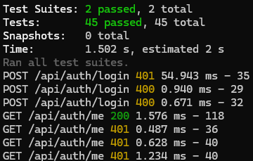

# 7. Pruebas

## 7.1. Metodología

PataPlan adopta una estrategia de pruebas **centrada en el backend**, donde reside la lógica de negocio más sensible: autenticación, control de permisos por grupo, cálculos de scoring, recálculo en cascada, detección de anomalías y validaciones de entrada.

El stack de testing es:

| Capa | Herramienta | Función |
|------|-------------|---------|
| Runner de tests | **Jest** | Ejecutor de tests, aserciones, mocking, reporte de cobertura |
| Pruebas HTTP del backend | **Supertest** | Simulación de peticiones HTTP a la app Express sin levantar puerto |
| Mocking de la base de datos | **`jest.mock`** | Sustitución del cliente de Prisma para aislar la capa de lógica |
| Pruebas del frontend (planificadas) | **React Testing Library + Vitest** | Tests de componentes y de hooks |

Se diferencian dos niveles de pruebas:

- **Pruebas unitarias**: validan una sola unidad de comportamiento (un endpoint, una función) con dependencias mockeadas. Son rápidas, deterministas y se ejecutan en cada push.
- **Pruebas de integración**: validan flujos completos cruzando varios endpoints encadenados (registro → login → creación de recurso → consulta del recurso) con el cliente de Prisma mockeado en memoria.

La configuración de Jest se declara en `server/package.json`:

```json
"jest": {
  "testEnvironment": "node",
  "setupFiles": ["./src/tests/setup.js"],
  "testMatch": ["**/src/tests/**/*.test.js"]
}
```

El fichero `setup.js` define las variables de entorno necesarias para ejecutar la app en modo test (`JWT_SECRET`, `JWT_EXPIRES_IN`, etc.) sin depender del `.env` del desarrollador.

## 7.2. Pruebas unitarias del backend

Los tests unitarios viven en `server/src/tests/` y siguen la convención `<recurso>.test.js`. Cada fichero agrupa los `describe` por endpoint y, dentro de cada uno, los `it` por caso (camino feliz, errores 400, errores 401, errores 403, errores 404, errores 409).

### 7.2.1. Suite de autenticación (`auth.test.js`)

Esta suite cubre los tres endpoints del módulo de autenticación: `POST /api/auth/register`, `POST /api/auth/login` y `GET /api/auth/me`.

**`POST /api/auth/register`:**

- `should register a new user successfully` — registra un usuario válido, comprueba que la respuesta es 201, que devuelve `user` y `token`, que el `passwordHash` no se filtra al cliente y que el JWT firmado decodifica correctamente con `userId` y `role`.
- `should return 409 if email already exists` — si Prisma devuelve un usuario existente, la respuesta es 409 con `error: "Email already registered"`.
- `should return 400 if name is missing` — la validación devuelve 400 si falta `name`.
- `should return 400 if email is missing` — la validación devuelve 400 si falta `email`.
- `should return 400 if password is missing` — la validación devuelve 400 si falta `password`.
- `should return 400 if email format is invalid` — la validación devuelve 400 si el email no respeta el formato.
- `should return 400 if password is shorter than 8 characters` — refuerza la regla mínima de longitud de contraseña.
- `should return 400 if body is empty` — petición sin cuerpo, 400.

**`POST /api/auth/login`:**

- `should login successfully with valid credentials` — credenciales correctas, comprueba la presencia del token y la ausencia de `passwordHash`, decodifica el JWT y verifica `userId` y `role`.
- `should return 401 if email does not exist` — usuario inexistente, 401 con mensaje genérico `"Invalid credentials"` (no se revela si el email está registrado o no).
- `should return 401 if password is wrong` — mismo mensaje genérico para contraseña incorrecta.
- `should return 400 if email is missing` — validación de entrada.
- `should return 400 if password is missing` — validación de entrada.

**`GET /api/auth/me`:**

- `should return user data with valid token` — devuelve los datos del usuario autenticado con cabecera `Authorization: Bearer <token>` válida.
- `should return 401 without Authorization header` — sin cabecera, 401.
- `should return 401 with invalid token` — token malformado, 401.
- `should return 401 with expired token` — token caducado (firmado con `expiresIn: '0s'`), 401.

### 7.2.2. Suite de animales (`animal.test.js`)

Esta suite cubre el CRUD completo de animales (`POST`, `GET`, `GET/:id`, `PUT/:id`, `DELETE/:id`) y verifica los filtros, el aislamiento entre usuarios y los permisos por rol.

**`POST /api/animals` — creación:**

- `should create an animal successfully` — caso feliz: devuelve 201 con el animal creado y su grupo.
- `should return 401 without authentication` — sin token, 401.
- `should return 400 if name is missing` — validación del campo obligatorio.
- `should return 400 if species is invalid` — solo se aceptan `DOG`, `CAT`, `OTHER`.
- `should return 400 if sex is invalid` — solo se aceptan `MALE`, `FEMALE`, `UNKNOWN`.
- `should return 400 if groupId belongs to another user` — el grupo existe pero no es del usuario; el endpoint **no revela su existencia** y responde 400.
- `should return 400 if groupId does not exist` — mismo error genérico.
- `should create an animal with only required fields` — comprueba que los campos opcionales (`breed`, `dateOfBirth`, `microchip`, etc.) pueden ir nulos.

**`GET /api/animals` — listado y filtros:**

- `should list all animals of the user` — devuelve solo los animales de los grupos del usuario.
- `should filter by groupId` — `?groupId=1` filtra por grupo.
- `should filter by species` — `?species=CAT` filtra por especie.
- `should search by name` — `?search=rock` hace búsqueda parcial e insensible a mayúsculas.
- `should return 401 without authentication` — sin token, 401.
- `should not return animals of another user` — un usuario distinto recibe lista vacía aunque consulte el mismo endpoint.

**`GET /api/animals/:id` — detalle:**

- `should return animal detail with group and event counts` — incluye los contadores de eventos por estado (`pending`, `completed`) y el último registro de peso.
- `should return 404 for non-existent animal` — 404 si el ID no existe.
- `should return 404 for animal of another user` — 404 (no 403) para no revelar la existencia del recurso.
- `should return 401 without authentication` — sin token, 401.

**`PUT /api/animals/:id` — actualización:**

- `should update an animal successfully` — actualización parcial del campo `name`.
- `should return 404 for animal of another user` — el usuario no puede modificar animales que no son suyos.
- `should return 400 when changing to groupId of another user` — no se puede mover un animal a un grupo ajeno.
- `should return 404 for non-existent animal` — 404 si el ID no existe.
- `should return 401 without authentication` — sin token, 401.

**`DELETE /api/animals/:id` — borrado:**

- `should delete an animal successfully` — borra el animal y verifica con un spy que se invoca `prisma.animal.delete` con el ID correcto.
- `should return 404 for animal of another user` — aislamiento entre usuarios.
- `should return 404 for non-existent animal` — 404 si el ID no existe.
- `should return 401 without authentication` — sin token, 401.
- `should return 403 for COLLABORATOR role` — un colaborador no puede borrar animales (solo el admin del grupo).

### 7.2.3. Patrón de mocking del cliente Prisma

Todos los tests siguen el mismo patrón: mockear el cliente de Prisma antes de importar la app para que Express use el cliente falso. Esto permite ejecutar la suite completa **sin necesidad de base de datos**, lo que la hace rápida (toda la suite termina en pocos segundos) y reproducible en CI:

```javascript
jest.mock('../utils/prisma');
const prisma = require('../utils/prisma');
const app = require('../app');

beforeEach(() => {
  jest.clearAllMocks();
});

it('should create an animal successfully', async () => {
  mockAuth(ADMIN_USER);
  mockGroups(1, [CASA_GROUP, REFUGIO_GROUP]);
  prisma.animal.create.mockResolvedValue(ROCKY);

  const res = await request(app)
    .post('/api/animals')
    .set('Authorization', `Bearer ${adminToken}`)
    .send({ name: 'Rocky', species: 'DOG', sex: 'MALE', groupId: 1 });

  expect(res.status).toBe(201);
  expect(res.body.animal.name).toBe('Rocky');
});
```

Las funciones helper `mockAuth(user)` y `mockGroups(userId, groups)` encapsulan la configuración repetida del mock para mantener cada test legible y centrado en lo que comprueba.

## 7.3. Pruebas de integración

Las pruebas de integración validan **flujos completos de usuario** encadenando varias llamadas a la API, comprobando que el estado entre peticiones se mantiene coherente.

### 7.3.1. Flujo crítico: registro → login → grupo → animal → evento → dashboard

Este flujo valida el camino más habitual de un usuario nuevo y atraviesa **seis endpoints** distintos:

1. **`POST /api/auth/register`** con email, nombre y contraseña → recibe `user` y `token`.
2. **`POST /api/auth/login`** con las mismas credenciales → recibe otro `token` válido.
3. **`POST /api/groups`** con `name: "Casa"` y el token → recibe el grupo creado con su `id`.
4. **`POST /api/animals`** con `name: "Rocky"`, `species: "DOG"`, `sex: "MALE"`, `groupId: <id del grupo>` → recibe el animal creado.
5. **`POST /api/health-events`** con `animalId`, `eventTypeId`, `scheduledDate` (fecha pasada para que esté vencido) → recibe el evento creado.
6. **`GET /api/dashboard`** → comprueba que el animal recién creado aparece en la sección de alertas con su evento vencido y un score asignado.

Las aserciones críticas del flujo:

- Cada paso devuelve el código HTTP esperado (201 para creaciones, 200 para consultas).
- El `id` de cada recurso creado se propaga correctamente al siguiente paso.
- El token de autenticación obtenido en el login funciona en todas las llamadas protegidas posteriores.
- El dashboard final devuelve el animal con el evento como alerta vencida.

### 7.3.2. Flujo de protocolo: asignar protocolo → completar evento con retraso → verificar cascada

Valida que el motor de recálculo en cascada funciona end-to-end:

1. Se crea un protocolo con tres pasos (días 0, 15 y 30).
2. Se asigna a un animal con `startDate` de hace 60 días.
3. Se completan los dos primeros eventos con retraso de 5 días.
4. Se consulta el animal y se verifica que el tercer evento se ha desplazado los 5 días correspondientes y mantiene el estado adecuado (`PENDING` o `OVERDUE` según la nueva fecha).

### 7.3.3. Flujo de anomalía de peso

Valida que al registrar un peso anómalo se crea automáticamente un evento de revisión:

1. Se crean cuatro registros de peso estables (por ejemplo 5.0, 5.1, 4.95, 5.05).
2. Se añade un quinto registro con desviación superior al 10% (por ejemplo 4.0 kg, -19%).
3. Se comprueba que la respuesta incluye `anomalyDetected: true` y un mensaje descriptivo.
4. Se consulta `GET /api/health-events?animalId=<id>` y se verifica que existe un evento de tipo `CHECKUP` con la nota correspondiente.

## 7.4. Cobertura de tests

### 7.4.1. Ejecutar la cobertura

Desde la carpeta `server/`:

```bash
npm test -- --coverage
```

Jest genera un informe en consola con cuatro métricas por fichero (statements, branches, functions, lines) y crea una carpeta `coverage/` con un informe HTML navegable en `coverage/lcov-report/index.html`.

Para ejecutar la cobertura de un fichero o suite concreta:

```bash
npm test -- --coverage --testPathPattern="auth"
```

### 7.4.2. Áreas cubiertas

Las pruebas actuales cubren las siguientes áreas críticas del backend:

| Área | Cobertura | Comentario |
|------|-----------|------------|
| Servicio de autenticación | Alta | Registro, login y verificación de token con todos los caminos de error. |
| Middleware de autenticación JWT | Alta | Tokens válidos, ausentes, malformados y caducados. |
| CRUD de animales | Alta | Casos felices, validaciones, filtros y permisos por usuario/rol. |
| Helpers de acceso a grupos (`getAccessibleGroupIds`, `getEditableGroupIds`) | Media | Cubierto indirectamente por los tests de animales y grupos. |
| Servicio de eventos | Media | Cálculo de `status` (`PENDING`/`OVERDUE`/`COMPLETED`), comparación de fechas sin horas. |
| Motor de recálculo en cascada | Media | Cubierto por las pruebas de integración del protocolo. |
| Detección de anomalías de peso | Media | Cubierto por las pruebas de integración de peso. |
| Sistema de scoring de alertas | Baja | Cubierto en su llamada agregada vía dashboard; tests unitarios pendientes. |
| Generación de PDF | Baja | Validación visual manual; las funciones puras (`formatDate`, `buildFilename`) son fáciles de testear y están en el roadmap. |

### 7.4.3. Áreas con cobertura pendiente

- Tests unitarios específicos para el algoritmo de scoring con casos calibrados (cachorro vencido, adulto vencido, animal recién ingresado).
- Tests del servicio de generación de PDF para verificar que las funciones puras (formateo de fechas, generación de filenames, agregación por categoría de gasto) son correctas.
- Tests de la subida de archivos (`multer`): validación de tamaño, tipos MIME permitidos.
- Tests de los endpoints de invitación a grupos: generación de código, unión por código, expulsión.

## 7.5. Pruebas del frontend

Los tests del **frontend** no se han incluido en el alcance del MVP del proyecto. La decisión ha sido **priorizar los tests del backend** por dos razones:

1. **Concentración de la lógica de negocio en el backend**: el frontend de PataPlan actúa principalmente como una capa de presentación sobre una API REST. La complejidad real (cálculo de scoring, recálculo de fechas, detección de anomalías, generación de PDF, control de permisos) vive en el servidor. Las regresiones lógicas en esos algoritmos son las que tienen más impacto si se cuelan, y son justamente las que un test bien escrito puede detectar.

2. **Coste/beneficio del testing de UI**: testear componentes React que pintan datos recibidos por API y validan formularios sencillos aporta menos cobertura efectiva por tiempo invertido que cubrir bien los servicios del backend. La validación visual durante el desarrollo y el feedback del usuario sobre la UI han cumplido el papel de detectar regresiones de presentación.

A medio plazo, el frontend incorporará tests con **Vitest + React Testing Library** centrándose en:

- Componentes de formulario (`AnimalForm`, `EventForm`, `ProtocolForm`) — validaciones inline y submit.
- Hooks personalizados (`useAuth`, `useAnimals`, `useDashboard`) — gestión de estado y llamadas API.
- Lógica del frontend que no es mero passthrough: filtros de la página de Calendario, ordenación de tablas, cálculo de totales del dashboard económico.

## 7.6. Resultados

A continuación se muestra una captura de la ejecución de la batería de tests del backend con el reporte de cobertura:

