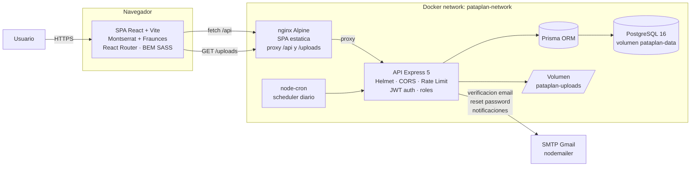
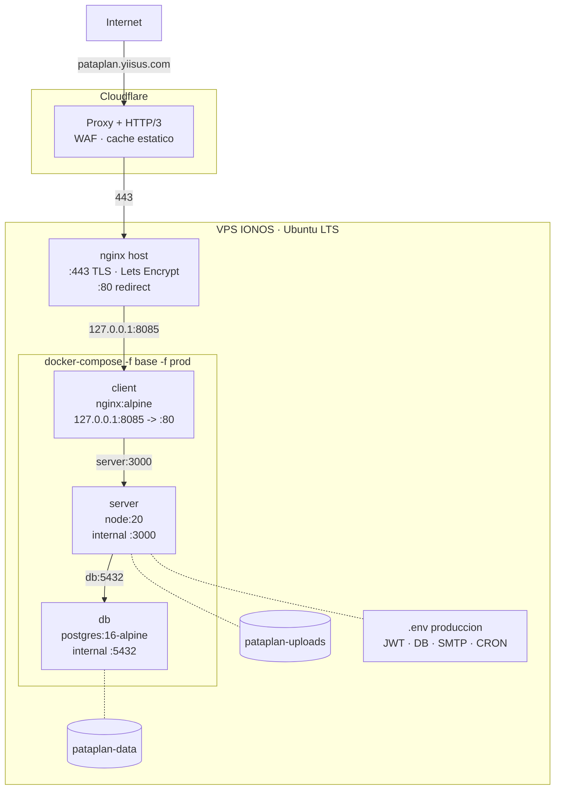
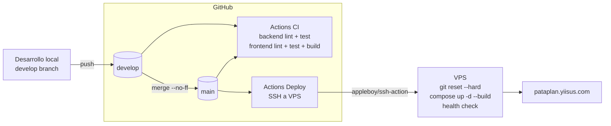

# 8. Despliegue

## 8.1. Entorno de producción

PataPlan está desplegada en un **VPS de IONOS** (Ubuntu Server LTS) con tres componentes orquestados por **Docker Compose**:

- **`db`** — instancia de **PostgreSQL 16 Alpine** con su volumen persistente.
- **`server`** — API REST construida con Node.js 20 + Express + Prisma, escuchando en el puerto interno 3000.
- **`client`** — SPA de React servida por **nginx Alpine** en el puerto 80, que además actúa como **reverse proxy** del backend para que las llamadas a `/api` lleguen al servicio `server` por la red interna de Docker.

La aplicación es accesible públicamente en:

> **<https://pataplan.yiisus.com>**

El VPS tiene asignado un dominio del autor (`yiisus.com`) y `pataplan` es un subdominio configurado mediante un registro `A` apuntando a la IP pública del servidor.

## 8.2. Arquitectura lógica

Vista de los componentes en tiempo de ejecución y sus relaciones:



**Componentes:**

- **SPA React** — interfaz de usuario; autentica con JWT en `localStorage` o `sessionStorage`. Hace todas las llamadas a `/api`.
- **nginx (cliente)** — sirve los assets de Vite y actúa como reverse-proxy interno hacia `server:3000` para `/api` y `/uploads`.
- **API Express** — REST con Helmet, CORS, rate limit y validación JWT. Usa Prisma como ORM.
- **PostgreSQL** — base de datos relacional, esquema versionado por migraciones de Prisma.
- **Scheduler** — `node-cron` lanza el job diario de notificaciones (`NOTIFICATIONS_CRON`, por defecto `0 9 * * *` `Europe/Madrid`).
- **Volúmenes** — `pataplan-data` (DB) y `pataplan-uploads` (fotos y documentos) persisten fuera de los contenedores.
- **SMTP Gmail** — usado para verificación de cuenta, reset de contraseña y notificaciones de eventos sanitarios.

## 8.3. Topología de despliegue

Vista física en el VPS, incluyendo Cloudflare y el reverse-proxy del host:



Detalles relevantes:

- **Cloudflare** termina TLS en el edge, cachea estáticos y aplica WAF.
- **nginx del host** termina HTTPS internamente con certificado Let's Encrypt y reenvía a `127.0.0.1:8085`.
- **Puerto 8085 (no 8080)** porque el 8080 está ocupado por otro servicio del VPS.
- **Ningún contenedor publica puertos al exterior**: solo `client` se mapea a `127.0.0.1`, inaccesible desde fuera. La DB y la API quedan en la red interna de Docker.
- **Volúmenes nombrados** garantizan que la DB y los uploads sobrevivan a reconstrucciones del contenedor.

## 8.4. Docker

### 8.4.1. Composes apilables

PataPlan adopta el patrón de **un fichero base + un override de producción**:

- `docker-compose.yml` — **base**: define el servicio `db` con `postgres:16-alpine`, su volumen `pataplan-data`, su `healthcheck` (`pg_isready`) y la red `pataplan-network`. No incluye credenciales ni publica puertos: lo completa el override.

- `docker-compose.prod.yml` — **producción**: añade `server` y `client` con los `Dockerfile` multi-stage, define las variables de entorno (`POSTGRES_*`, `JWT_SECRET`, `SMTP_*`, `NOTIFICATIONS_*`, etc.), monta el volumen `pataplan-uploads:/app/uploads` en el servidor, expone el puerto `127.0.0.1:8085 → :80` solo en el cliente (no accesible desde fuera del host), y aplica `restart: unless-stopped` a los tres servicios. El servidor arranca con `npx prisma migrate deploy && npm start`, así las migraciones se aplican automáticamente en cada despliegue.

**Desarrollo local** se hace fuera de Docker para iteración rápida con HMR de Vite y nodemon:

```bash
# Solo la base de datos en Docker
docker compose up -d db

# Backend
cd server && npm run dev

# Frontend (otra terminal)
cd client && npm run dev
```

**Producción** (en el VPS, lo lanza el workflow de Deploy automáticamente):

```bash
docker compose -f docker-compose.yml -f docker-compose.prod.yml up -d --build
```

Las variables de entorno se leen del fichero `.env` del host. No se commitéan al repositorio: se documentan en `.env.example`.

### 8.4.2. Dockerfile del backend (`server/Dockerfile`)

Multi-stage de dos etapas para reducir el tamaño de la imagen final:

```dockerfile
FROM node:20-alpine AS build
WORKDIR /app
COPY package*.json ./
RUN npm ci --only=production
COPY . .
RUN npx prisma generate

FROM node:20-alpine
WORKDIR /app
COPY --from=build /app/node_modules ./node_modules
COPY --from=build /app/package*.json ./
COPY --from=build /app .
EXPOSE 3000
CMD ["npm", "start"]
```

- **Etapa `build`**: instala dependencias de producción (`--only=production`) y genera el cliente de Prisma. Este paso es necesario en build porque el cliente generado depende del schema y debe quedar empaquetado dentro de la imagen.
- **Etapa final**: parte de una imagen base limpia y copia exclusivamente lo necesario para correr, dejando fuera todos los artefactos intermedios de instalación. La imagen resultante pesa aproximadamente 200 MB.

### 8.4.3. Dockerfile del frontend (`client/Dockerfile`)

Multi-stage de dos etapas, con cambio de imagen base entre etapas:

```dockerfile
FROM node:20-alpine AS build
WORKDIR /app
COPY package*.json ./
RUN npm ci
COPY . .
RUN npm run build

FROM nginx:alpine
COPY --from=build /app/dist /usr/share/nginx/html
COPY nginx.conf /etc/nginx/conf.d/default.conf
EXPOSE 80
CMD ["nginx", "-g", "daemon off;"]
```

- **Etapa `build`**: instala dependencias (incluidas las de desarrollo, necesarias para Vite) y ejecuta `npm run build`, que genera la versión optimizada del SPA en `/app/dist`.
- **Etapa final**: parte de **nginx Alpine** (~25 MB), copia los estáticos generados en la etapa anterior y la configuración personalizada de nginx. No queda rastro de Node ni de npm en la imagen final.

### 8.4.4. nginx como reverse proxy interno

`client/nginx.conf` cumple dos funciones:

```nginx
server {
    listen 80;
    server_name localhost;
    root /usr/share/nginx/html;
    index index.html;

    location /api {
        proxy_pass http://server:3000;
        proxy_http_version 1.1;
        proxy_set_header Host $host;
        proxy_set_header X-Real-IP $remote_addr;
        proxy_set_header X-Forwarded-For $proxy_add_x_forwarded_for;
        proxy_set_header X-Forwarded-Proto $scheme;
    }

    location / {
        try_files $uri $uri/ /index.html;
    }
}
```

- **`location /api`**: redirige las llamadas a la API hacia el contenedor `server` por el nombre de servicio de Docker (`http://server:3000`). Así el frontend hace todas sus llamadas a su propio origen (`/api/...`) y no hay CORS ni necesidad de URL del backend en runtime.
- **`location /`**: sirve el SPA con fallback a `index.html` para que las rutas del cliente (`/animals/42`, `/calendar`, etc.) funcionen tras un refresco del navegador.

## 8.5. HTTPS y red

La terminación TLS pasa por dos capas: **Cloudflare** en el edge y **nginx en el host** detrás. El contenedor `client` solo habla HTTP simple en `127.0.0.1:8085`, nunca expone TLS.

**Capa 1 — Cloudflare (edge)**

- El dominio `pataplan.yiisus.com` apunta a Cloudflare (registros `A`/`CNAME` proxy-enabled).
- Cloudflare termina TLS para el usuario final con su propio certificado, ofrece HTTP/3, cache estático y WAF gratuito.
- Cloudflare reenvía al origen (VPS) en HTTPS usando el modo **Full (strict)**: valida el certificado del origen antes de reenviar.

**Capa 2 — nginx en el host (origen)**

El host del VPS corre un nginx (fuera de Docker) que termina la conexión proveniente de Cloudflare, valida con un certificado **Let's Encrypt** emitido para `pataplan.yiisus.com` y reenvía al contenedor `client` en `127.0.0.1:8085`:

```nginx
server {
    listen 443 ssl http2;
    server_name pataplan.yiisus.com;

    ssl_certificate     /etc/letsencrypt/live/pataplan.yiisus.com/fullchain.pem;
    ssl_certificate_key /etc/letsencrypt/live/pataplan.yiisus.com/privkey.pem;

    location / {
        proxy_pass http://127.0.0.1:8085;
        proxy_set_header Host $host;
        proxy_set_header X-Real-IP $remote_addr;
        proxy_set_header X-Forwarded-For $proxy_add_x_forwarded_for;
        proxy_set_header X-Forwarded-Proto $scheme;
    }
}

server {
    listen 80;
    server_name pataplan.yiisus.com;
    return 301 https://$host$request_uri;
}
```

Certificados emitidos y renovados automáticamente con:

```bash
sudo certbot --nginx -d pataplan.yiisus.com
sudo systemctl enable certbot.timer
```

El timer de `systemd` ejecuta `certbot renew` dos veces al día. Si un certificado está a menos de 30 días de caducar, lo renueva sin intervención.

**Por qué dos capas:** Cloudflare aporta CDN/WAF/HTTP3 sin coste adicional pero exige TLS entre Cloudflare y el origen para que la cadena sea íntegra (modo Full strict). El nginx del host con Let's Encrypt cubre ese segundo tramo.

## 8.6. CI/CD con GitHub Actions

El repositorio incluye **dos workflows** complementarios: uno de integración continua (CI) que se dispara en push y pull request a `develop` o `main`, y uno de despliegue (Deploy) que se dispara solo en push a `main`. Los ficheros viven en `.github/workflows/ci.yml` y `.github/workflows/deploy.yml`.



### 8.6.1. Pasos del workflow CI

El workflow tiene tres jobs que se ejecutan en paralelo:

**Job `lint`** — verifica que el código respeta las convenciones de estilo.

```yaml
- uses: actions/checkout@v4
- uses: actions/setup-node@v4
  with: { node-version: '20', cache: 'npm' }
- run: npm ci --prefix server
- run: npm run lint --prefix server
- run: npm ci --prefix client
- run: npm run lint --prefix client
```

**Job `test`** — ejecuta la suite de tests del backend con Jest, incluida la cobertura.

```yaml
- uses: actions/checkout@v4
- uses: actions/setup-node@v4
  with: { node-version: '20', cache: 'npm' }
- run: npm ci --prefix server
- run: npm test --prefix server -- --coverage
- uses: actions/upload-artifact@v4
  with:
    name: coverage-report
    path: server/coverage
```

El informe de cobertura se sube como artefacto del workflow, lo que permite descargarlo desde la pestaña Actions de GitHub para revisarlo sin tener que regenerarlo localmente.

**Job `build`** — construye las imágenes Docker para validar que el `Dockerfile` y el `docker-compose.prod.yml` siguen funcionando.

```yaml
- uses: actions/checkout@v4
- uses: docker/setup-buildx-action@v3
- run: docker compose -f docker-compose.yml -f docker-compose.prod.yml build
```

Si cualquiera de los tres jobs falla, el PR no puede mergearse: las ramas `main` y `develop` están protegidas con **branch protection rules** que exigen estado verde antes de permitir merge.

### 8.6.2. Dependabot

Configurado en `.github/dependabot.yml`, abre PRs automáticos cuando:

- Hay actualizaciones de paquetes de npm en `server/` o `client/`.
- Hay actualizaciones de versiones de las propias GitHub Actions usadas en el workflow.
- Se publica una vulnerabilidad de seguridad en alguna dependencia.

Los PRs de Dependabot pasan por el mismo CI que cualquier otro: si los tests siguen pasando con la nueva versión, el PR queda listo para revisión.

## 8.7. Proceso de despliegue

El despliegue es **automático**: cada push a `main` dispara el workflow `.github/workflows/deploy.yml`, que se conecta por SSH al VPS y aplica los cambios sin intervención manual. El detalle del flujo aparece en el diagrama de [8.6](#86-cicd-con-github-actions).

### 8.7.1. Pasos del workflow `deploy.yml`

El workflow ejecuta este script remoto vía `appleboy/ssh-action`:

```bash
set -e
cd /var/www/pata-plan

# 1. Sincronizar con origin/main de forma declarativa
#    git reset --hard descarta cualquier edicion local y deja el VPS
#    como mirror exacto de la rama main
git fetch origin main
git reset --hard origin/main

# 2. Validar que el .env existe y tiene la clave critica
if [ ! -f .env ]; then
  echo "ERROR: .env file not found. Deployment aborted."
  exit 1
fi
if ! grep -q "JWT_SECRET=" .env; then
  echo "ERROR: JWT_SECRET not defined in .env. Deployment aborted."
  exit 1
fi

# 3. Reconstruir contenedores que cambiaron y mantener los demas
#    up -d --build NO recrea db si su imagen no ha cambiado,
#    asi que los volumenes de DB y uploads sobreviven
docker compose -f docker-compose.yml -f docker-compose.prod.yml up -d --build

# 4. Limpiar imagenes huerfanas
docker image prune -f

# 5. Health check
sleep 10
curl -fsS http://localhost:8085/ > /dev/null || (echo "Healthcheck failed"; exit 1)
echo "Deploy OK"
```

**Aspectos clave:**

- **`git reset --hard origin/main`** (no `git pull`) garantiza un VPS que es mirror exacto de `main`. Cualquier edición local en el VPS se descarta automáticamente; los archivos gitignorados (`.env`, volúmenes) NO se tocan.
- **`up -d --build`** solo recrea los servicios cuya imagen ha cambiado. Como `db` usa `postgres:16-alpine` sin cambios, el contenedor de base de datos NO se recrea y la conexión se mantiene viva durante el despliegue.
- **Migraciones automáticas**: el `CMD` del Dockerfile del servidor es `sh -c "npx prisma migrate deploy && npm start"`, así que cualquier migración pendiente se aplica al arrancar el nuevo contenedor `server`.
- **Healthcheck final**: si el `curl` falla, el job termina en rojo y se ve en la pestaña Actions de GitHub.

### 8.7.2. Secrets necesarios en GitHub

Configurados en `Settings → Secrets and variables → Actions`:

| Secret | Contenido |
|---|---|
| `VPS_HOST` | IP o dominio del VPS |
| `VPS_USER` | Usuario SSH (típicamente `root`) |
| `VPS_SSH_KEY` | Clave privada SSH completa (con `BEGIN`/`END`) cuya clave pública está en `~/.ssh/authorized_keys` del VPS |

### 8.7.3. Despliegue manual (failover)

Si el workflow no se dispara por alguna razón (Actions caído, problemas de red), se puede replicar a mano entrando por SSH al VPS y ejecutando el mismo script. También está disponible **trigger manual** en `Actions → Deploy to VPS → Run workflow`.

El tiempo total de un despliegue típico es de **2-3 minutos**, con downtime de **5-10 segundos** durante el swap del contenedor `client` (la DB no se toca).

### 8.7.4. Backups

Antes de cada despliegue que incluya una migración de base de datos, se hace un **dump previo**:

```bash
docker compose -f docker-compose.yml -f docker-compose.prod.yml exec db \
  pg_dump -U pataplan pataplan > /backups/pataplan-$(date +%Y%m%d-%H%M%S).sql
```

Adicionalmente, **una tarea cron diaria** en el host hace un dump completo de la base de datos y lo guarda en `/backups/`, manteniendo los últimos 30 días.

## 8.8. Monitorización

### 8.8.1. Healthcheck del backend

El servidor expone un endpoint público de salud en la raíz:

```
GET /
→ 200 OK
  { "status": "ok", "message": "PataPlan API" }
```

Implementado en `server/src/app.js`. Se usa para verificar tras el despliegue que el contenedor está respondiendo correctamente:

```bash
curl -fsS https://pataplan.yiisus.com/api/ || echo "API DOWN"
```

### 8.8.2. Healthcheck de la base de datos

El servicio `db` de Docker Compose tiene su propio healthcheck definido en el `docker-compose.yml` base:

```yaml
healthcheck:
  test: ["CMD-SHELL", "pg_isready -U ${POSTGRES_USER:-pataplan}"]
  interval: 10s
  timeout: 5s
  retries: 5
```

Esto bloquea el arranque del contenedor `server` hasta que PostgreSQL está aceptando conexiones (`depends_on: condition: service_healthy`), evitando reintentos manuales tras un reinicio completo.

### 8.8.3. Logs

Los logs de cada servicio son accesibles vía Docker:

```bash
# Logs del backend en tiempo real
docker compose -f docker-compose.yml -f docker-compose.prod.yml logs -f server

# Últimas 200 líneas del nginx del cliente
docker compose -f docker-compose.yml -f docker-compose.prod.yml logs --tail 200 client

# Errores recientes de la base de datos
docker compose -f docker-compose.yml -f docker-compose.prod.yml logs db | grep -i error
```

El backend usa **`morgan`** como logger HTTP en modo `dev`, lo que produce una línea por petición con método, ruta, código de estado y tiempo de respuesta. Esto es suficiente para diagnóstico básico durante el MVP.

### 8.8.4. Uptime externo

Para vigilancia 24/7 desde fuera del propio VPS, se usa un servicio gratuito de monitorización externa (**UptimeRobot**) configurado con dos checks cada cinco minutos:

- `GET https://pataplan.yiisus.com/` — verifica que el SPA responde con 200.
- `GET https://pataplan.yiisus.com/api/` — verifica que el endpoint de salud del backend devuelve `{ "status": "ok" }`.

Si cualquiera de los dos falla dos comprobaciones seguidas, UptimeRobot envía una notificación por correo al autor.
