# 9. Manual de usuario

¡Bienvenido a **PataPlan**! Esta guía te acompaña paso a paso por todo lo que puedes hacer con la aplicación. No hace falta que sepas nada de informática: si has usado alguna vez una agenda o una web de servicios, esto te va a resultar sencillo.

A lo largo del manual verás referencias a **capturas de pantalla** en la carpeta `docs/assets/`. Cuando veas el nombre de una imagen, ese es el archivo que ilustra ese paso concreto.

## 9.1. Registrarte y entrar a la aplicación

### 9.1.1. Crear tu cuenta

1. Entra en <https://pataplan.yiisus.com>.
2. En la pantalla de bienvenida, pulsa **"Crear cuenta"**.
3. Rellena el formulario con tu **nombre**, tu **correo electrónico** y una **contraseña** (mínimo 8 caracteres).
4. Pulsa **"Registrarme"**.

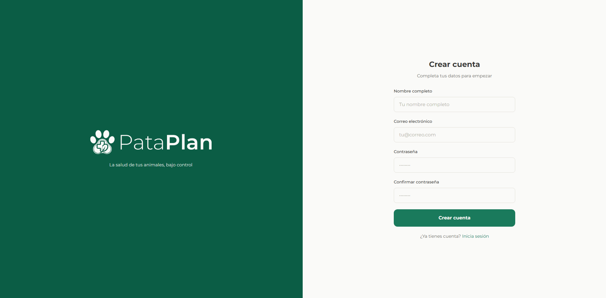

### 9.1.2. Verificar tu correo

Después de registrarte, PataPlan te envía un **email de verificación** a la dirección que has indicado. Esto sirve para confirmar que el correo es realmente tuyo.

1. Abre tu bandeja de entrada (revisa también la carpeta de spam por si acaso).
2. Pulsa el enlace que aparece en el correo. Te lleva de vuelta a PataPlan con tu cuenta ya verificada.
3. Si han pasado más de 24 horas y el enlace ya no funciona, en la pantalla de login puedes pedir uno nuevo.

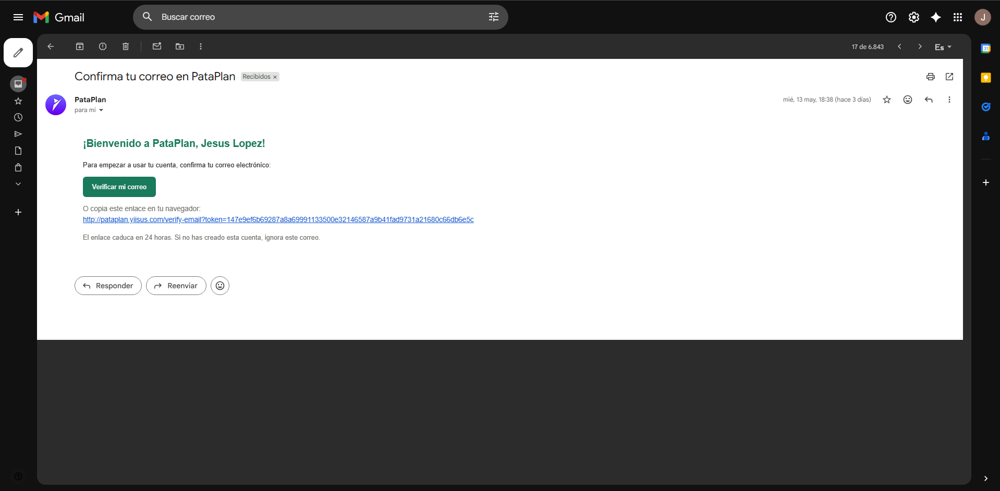

### 9.1.3. Iniciar sesión

1. Vuelve a <https://pataplan.yiisus.com> y entra con tu **correo** y **contraseña**.
2. Si quieres que la sesión se mantenga abierta durante 30 días en este dispositivo, marca la casilla **"Mantener sesión iniciada"** antes de entrar. Útil si es tu ordenador personal; **no la marques** en ordenadores compartidos.

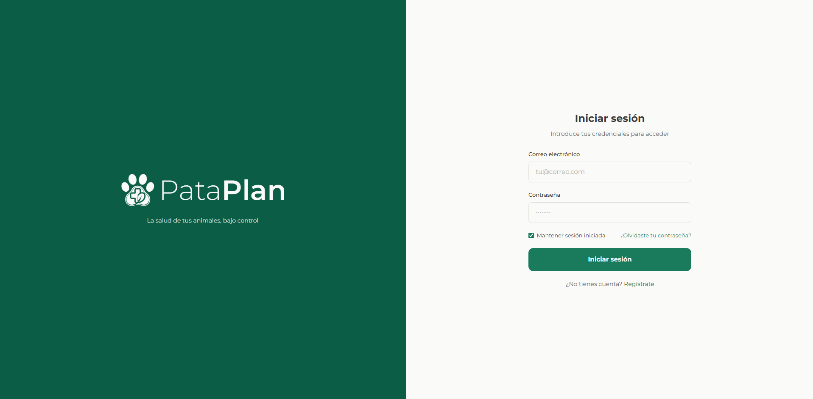

### 9.1.4. Si olvidas tu contraseña

1. En la pantalla de login pulsa **"¿Olvidaste tu contraseña?"**.
2. Introduce tu correo y pulsa **"Enviar enlace"**.
3. Revisa tu bandeja de entrada: recibirás un correo con un enlace para restablecerla. El enlace caduca al cabo de 1 hora.
4. Pulsa el enlace, escribe la nueva contraseña dos veces y pulsa **"Cambiar contraseña"**.

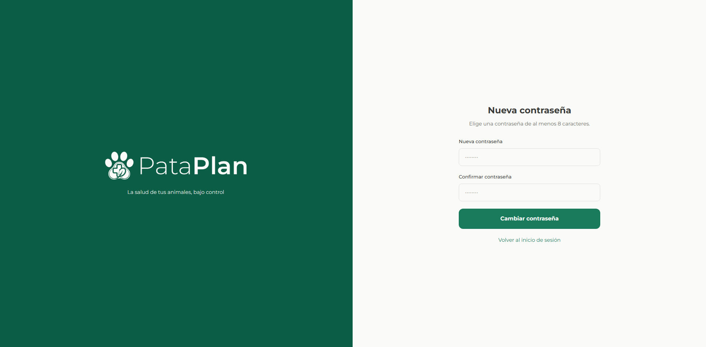

## 9.2. Conocer el panel principal (Dashboard)

Cuando entras a PataPlan, lo primero que ves es el **dashboard**: un resumen de qué necesitas atender hoy.

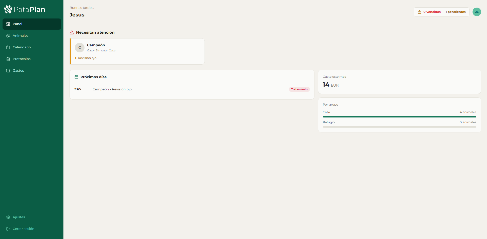

El dashboard tiene cuatro zonas principales:

- **Animales que necesitan atención**: una lista ordenada por urgencia, con la foto del animal, qué evento tiene pendiente y los días de retraso. **Lo más urgente sale primero**, no por orden cronológico, sino por importancia real (más adelante te explicamos cómo se calcula).
- **Próximos días**: los eventos previstos para los próximos siete días, para que sepas qué se te viene encima.
- **Resumen económico**: cuánto llevas gastado este mes y comparativa con el mes anterior.
- **Reparto por grupo**: cuántos animales tienes en cada grupo (Casa, Refugio, etc.).

### 9.2.1. Entender los colores de las alertas

Las alertas usan un código de color sencillo:

- 🔴 **Rojo (vencido)**: el evento debería haberse hecho ya. Hay que actuar.
- 🟡 **Ámbar (pendiente próximo)**: el evento se acerca, conviene tenerlo en cuenta.
- 🟢 **Verde (al día)**: hecho a tiempo.

## 9.3. Añadir un grupo y un animal

### 9.3.1. Crear un grupo

Los grupos son tu forma de organizar los animales. Puedes crear, por ejemplo, "Casa" para tus mascotas y "Refugio" para los animales que cuidas en una protectora.

1. En el menú lateral, pulsa **"Grupos"**.
2. Pulsa el botón **"+ Añadir grupo"**.
3. Escribe el **nombre** (por ejemplo, "Refugio Las Acacias") y, si quieres, una descripción.
4. Pulsa **"Guardar"**.

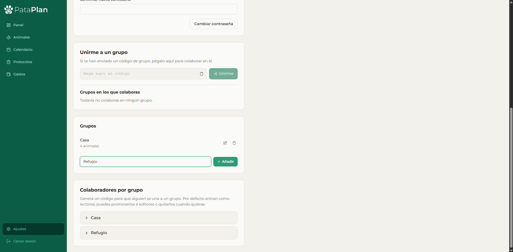

### 9.3.2. Añadir un animal

1. En el menú lateral, pulsa **"Animales"**.
2. Pulsa **"+ Añadir animal"**.
3. Rellena la ficha:
   - **Nombre** (obligatorio).
   - **Especie**: perro, gato u otro.
   - **Sexo**: macho, hembra o desconocido.
   - **Grupo** al que pertenece.
   - **Fecha de nacimiento**, **raza**, **microchip**, **foto** y **notas** (todo opcional).
4. Pulsa **"Guardar"**.

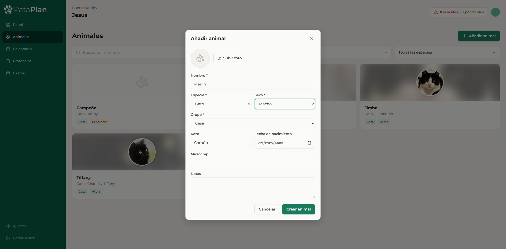

Tu animal aparece ya en el listado. Si pulsas sobre su tarjeta, entras a su **ficha completa**, donde tienes pestañas para todo lo demás: eventos sanitarios, visitas, peso, documentos y gastos.

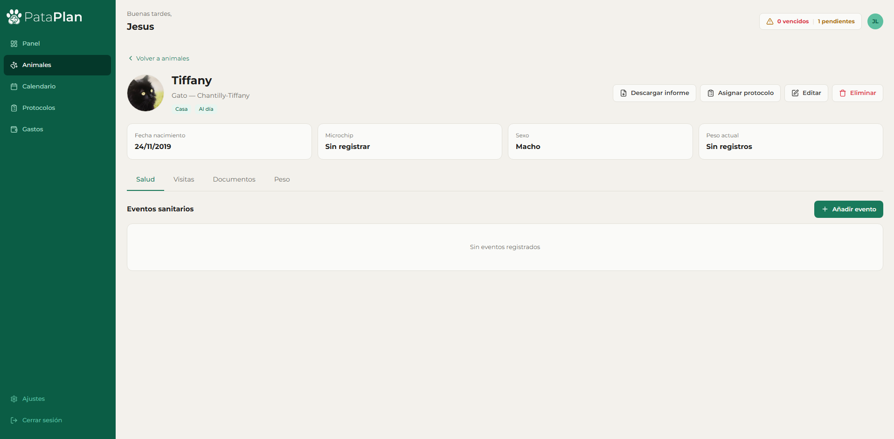

## 9.4. Registrar un evento sanitario

Un "evento sanitario" es cualquier actuación: una vacuna, una desparasitación, un tratamiento o una revisión.

1. Entra a la **ficha del animal**.
2. En la pestaña **"Calendario"**, pulsa **"+ Añadir evento"**.
3. Rellena los campos:
   - **Tipo de evento** (vacuna, desparasitación interna, externa, tratamiento o revisión).
   - **Fecha programada**.
   - **Producto utilizado** (opcional pero recomendable).
   - **Veterinario** (opcional).
   - **Notas** (opcional).
   - **Frecuencia en días** (opcional): si la pones, el sistema calculará automáticamente la siguiente dosis cuando marques este evento como realizado.
4. Pulsa **"Guardar"**.

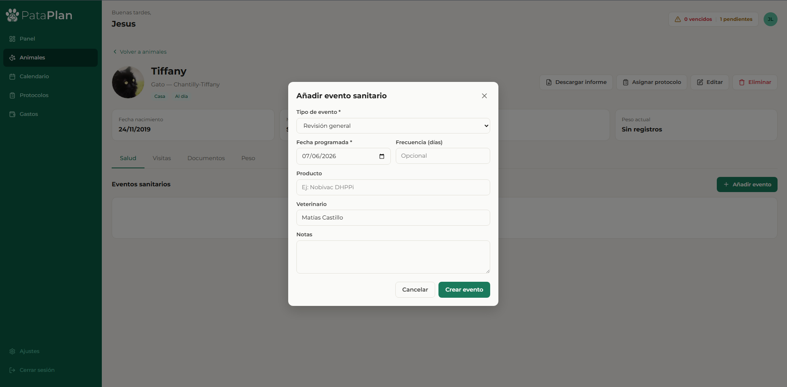

### 9.4.1. Marcar un evento como realizado

Cuando hagas la actuación:

1. En el calendario o en la lista de eventos, **pulsa sobre el evento**.
2. Pulsa **"Marcar como realizado"**.
3. Indica la **fecha real** en la que se hizo (por defecto es hoy).
4. Si el evento tenía frecuencia, se crea automáticamente el siguiente.

## 9.5. Crear un protocolo y asignarlo

Los protocolos son **plantillas** de actuaciones que se aplican juntas. Por ejemplo, "Gato nuevo en refugio" puede definir: desparasitación día 0, primera vacuna día 15, segunda dosis día 45 y revisión día 60. Te ahorras introducir cada evento a mano cada vez que entra un animal nuevo.

### 9.5.1. Crear un protocolo

1. En el menú lateral, pulsa **"Protocolos"**.
2. Pulsa **"+ Nuevo protocolo"**.
3. Pon un **nombre** descriptivo y una breve **descripción**.
4. Añade los **pasos**, uno por uno:
   - **Día relativo al inicio** (0 = el primer día, 15 = a los 15 días, etc.).
   - **Tipo de evento**.
   - **Notas o producto** sugerido.
5. Pulsa **"Guardar protocolo"**.

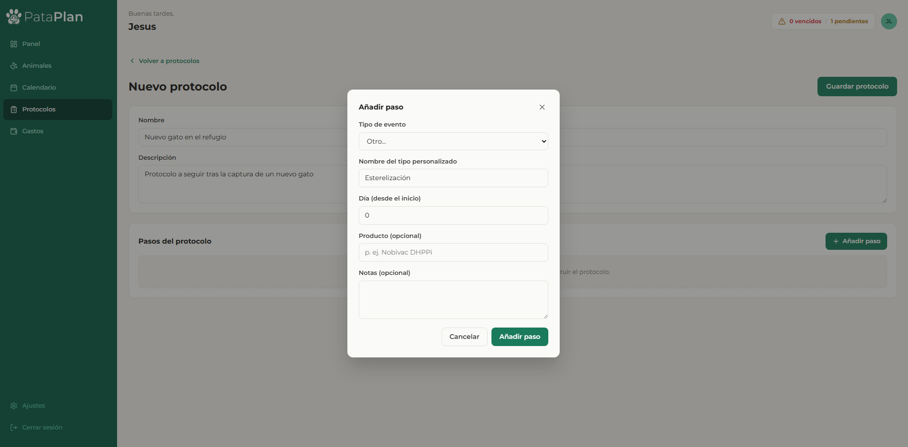

### 9.5.2. Asignar el protocolo a un animal

1. Entra a la **ficha del animal**.
2. En la pestaña **"Protocolos"** pulsa **"Asignar protocolo"**.
3. Elige el protocolo y la **fecha de inicio**.
4. Pulsa **"Asignar"**.

Verás cómo todos los eventos del protocolo aparecen automáticamente en el calendario del animal, con sus fechas ya calculadas.

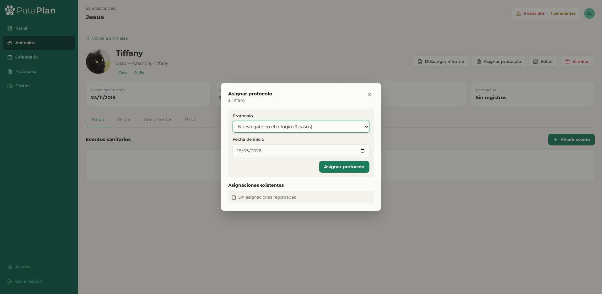

## 9.6. Cómo se recalculan las fechas si hay retraso

Imagina que has asignado el protocolo "Gato nuevo en refugio" a Luna. Una de las primeras vacunas estaba programada para el día 15, pero por un imprevisto la pones el día 22. **PataPlan recalcula automáticamente** los pasos siguientes para que mantengan el mismo intervalo entre ellos.

1. Marcas la vacuna como realizada con la fecha real (el día 22).
2. El sistema detecta que llevas **7 días de retraso**.
3. La segunda dosis, que estaba para el día 45, se mueve al día **52**.
4. La revisión, que estaba para el día 60, se mueve al día **67**.

Esto pasa de forma transparente: tú solo marcas el evento como realizado y el resto del protocolo se ajusta solo. Aparece un aviso indicándote cuántos eventos se han recalculado.

> **Importante**: el sistema solo recalcula los eventos del **mismo protocolo** que aún están **pendientes**. No toca los eventos ya completados ni los eventos sueltos que hayas creado tú a mano.

## 9.7. Registrar una visita veterinaria

Las visitas son el **historial clínico independiente** de tu animal: no dependen de ninguna clínica concreta, así que aunque cambies de veterinario, tu información sigue contigo.

1. Entra a la **ficha del animal**.
2. En la pestaña **"Visitas"** pulsa **"+ Añadir visita"**.
3. Rellena:
   - **Fecha** de la visita.
   - **Motivo** (qué llevaste a hacer).
   - **Veterinario** que atendió.
   - **Diagnóstico**.
   - **Tratamiento** recetado.
   - **Observaciones** libres.
4. Pulsa **"Guardar"**.

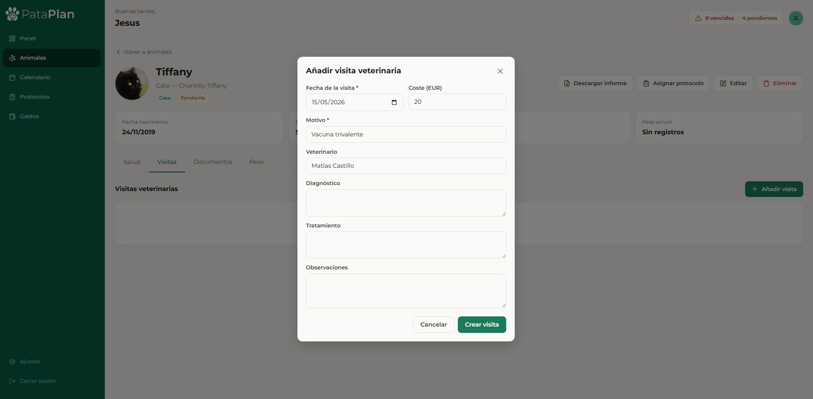

Las visitas aparecen en orden cronológico inverso (la más reciente primero), para que veas siempre lo último primero.

## 9.8. Subir documentos

Puedes adjuntar a cada animal **cartillas escaneadas, analíticas, informes** o cualquier documento relacionado.

1. En la **ficha del animal**, pestaña **"Documentos"**.
2. Pulsa **"+ Subir documento"**.
3. Selecciona el archivo desde tu ordenador o móvil (PDF, JPG, PNG; tamaño máximo 10 MB).
4. Pon un **nombre descriptivo** (por ejemplo "Analítica abril 2026").
5. Pulsa **"Subir"**.

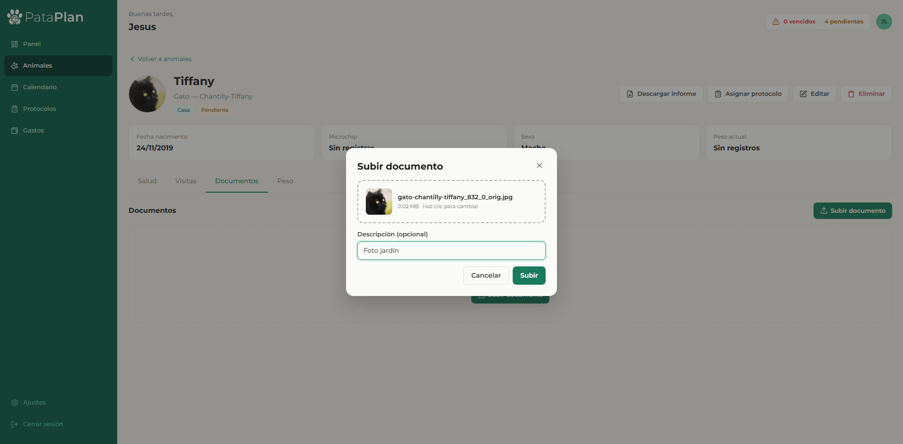

Una vez subido, puedes **previsualizar** las imágenes y los PDF directamente desde la ficha, o **descargar** el archivo original.

## 9.9. Registrar un gasto

Llevar el control de lo que cuesta cuidar a cada animal es especialmente útil en refugios y para hogares con varios animales.

1. En el menú lateral pulsa **"Gastos"**.
2. Pulsa **"+ Añadir gasto"**.
3. Rellena:
   - **Grupo** (Casa, Refugio…).
   - **Animal** al que asociar el gasto (la lista se filtra según el grupo elegido).
   - **Importe** en euros.
   - **Categoría**: vacuna, desparasitación, cirugía, medicación, alimentación u otros.
   - **Fecha**.
   - **Descripción** libre (opcional).
4. Pulsa **"Guardar"**.

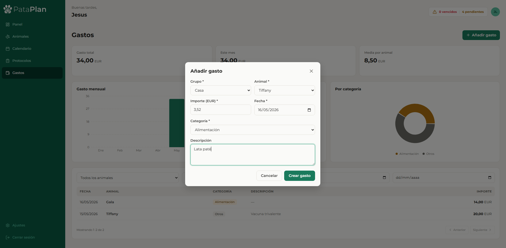

En la sección **"Gastos"** verás el resumen económico:

- **Total gastado** desde que usas PataPlan.
- **Gasto del mes** actual y comparativa con el mes anterior.
- **Media por animal**.
- Gráfico de **evolución mensual** y **reparto por categoría**.

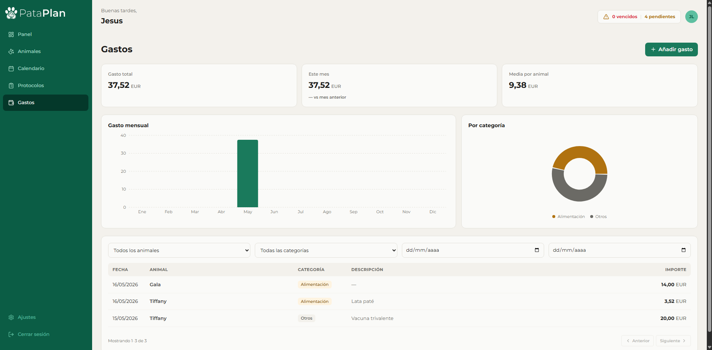

## 9.10. Generar un informe PDF

PataPlan puede generarte un **informe sanitario completo** del animal en formato PDF. Es muy útil para entregarlo al adoptar, en traslados, o al cambiar de veterinario.

1. Entra a la **ficha del animal**.
2. En la cabecera, pulsa el botón **"Descargar informe"** (icono de PDF).
3. Espera unos segundos: el archivo se descarga automáticamente con un nombre tipo `informe-luna-2026-05-16.pdf`.

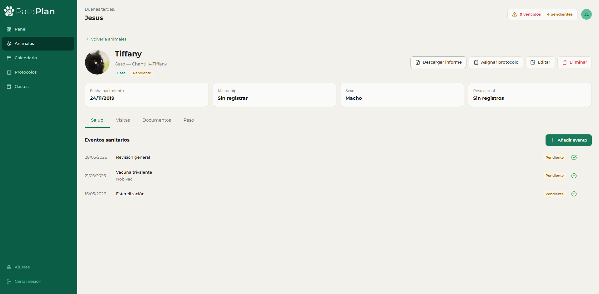

El PDF incluye:

- Datos del animal (foto, especie, raza, sexo, fecha de nacimiento, microchip, grupo, notas).
- Historial de vacunas con fecha, producto y veterinario.
- Historial de desparasitaciones.
- Tratamientos.
- Visitas veterinarias.
- Evolución de peso con estadísticas y anomalías detectadas.
- Resumen de gastos por categoría.

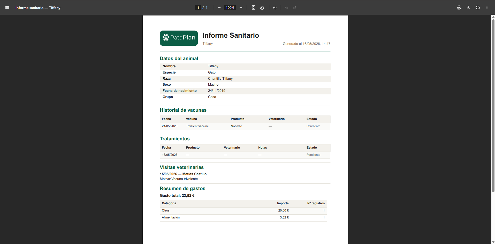

## 9.11. Registrar peso y detectar anomalías

Mantener un control del peso es importante, especialmente en animales jóvenes o con problemas de salud.

### 9.11.1. Añadir un registro de peso

1. En la **ficha del animal**, pestaña **"Peso"**.
2. Pulsa **"+ Añadir registro"**.
3. Introduce el **peso en kilos** y la **fecha** del pesaje.
4. Pulsa **"Guardar"**.

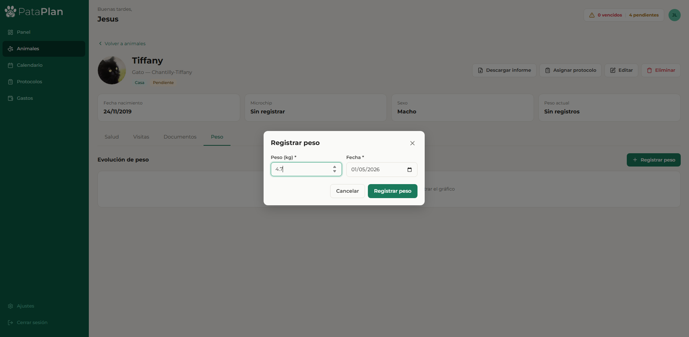

### 9.11.2. Gráfica y estadísticas

En la misma pestaña ves la **evolución del peso** en una gráfica, junto con datos útiles: peso actual, media histórica, mínimo y máximo.

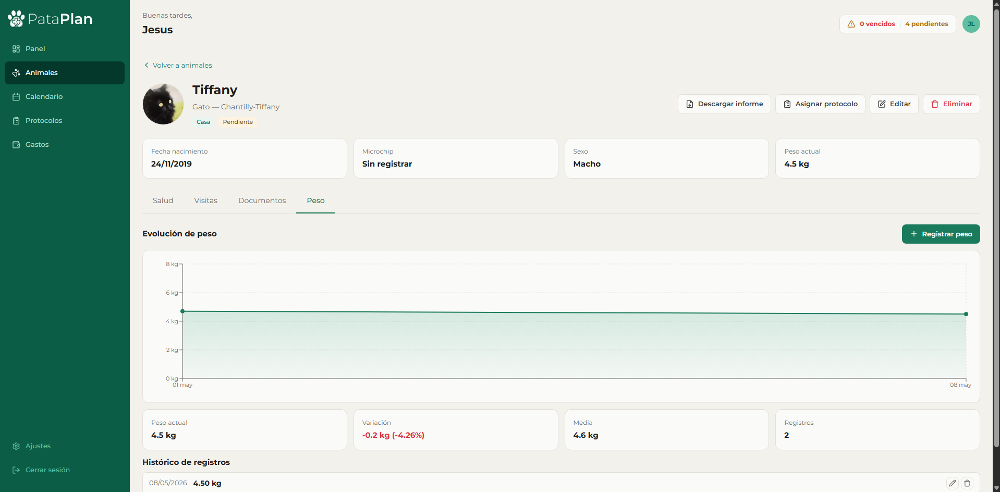

### 9.11.3. Anomalías de peso

PataPlan vigila los registros de peso por ti. Si tras tres o más medidas detecta una **variación importante** (más del 10% respecto a la media reciente del animal), genera automáticamente:

- Una **marca de anomalía** en ese registro (se muestra en rojo en la gráfica).
- Un **evento de revisión** pendiente en el calendario, para que lo evalúes.

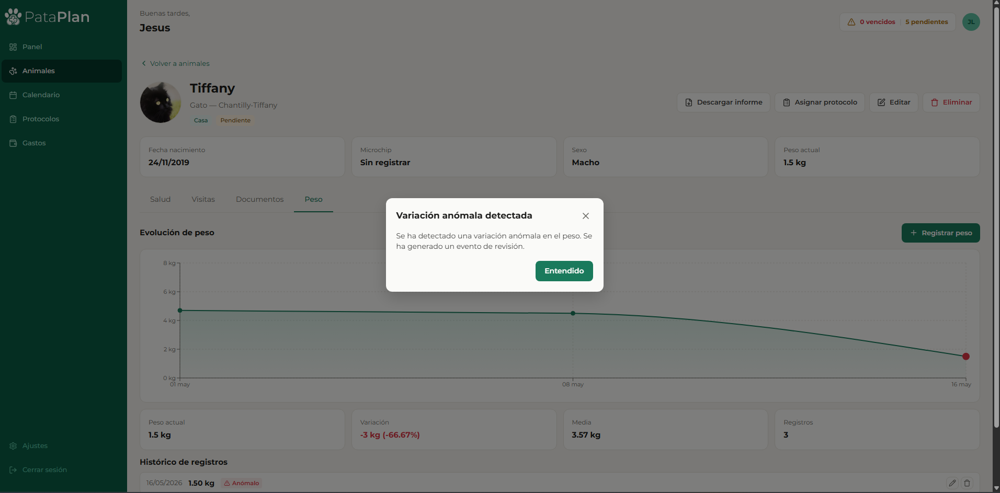

No te alarmes: una anomalía no significa siempre un problema, pero merece la pena revisarlo. A veces es simplemente que el animal está creciendo, que ha cambiado de dieta o que la báscula no estaba bien tarada.

## 9.12. Invitar a un colaborador

Si más de una persona se ocupa de los animales, puedes **compartir un grupo** con otra cuenta de PataPlan.

### 9.12.1. Generar un código de invitación

1. En **"Grupos"**, pulsa sobre el grupo que quieres compartir.
2. En la sección **"Colaboradores"** pulsa **"Generar código de invitación"**.
3. Elige el **rol** que tendrá la persona invitada:
   - **Lector**: solo puede ver la información, no la modifica.
   - **Editor**: puede registrar eventos, visitas, pesos y gastos, pero no cambiar la configuración del grupo.
4. Copia el código que aparece y envíaselo a la otra persona.

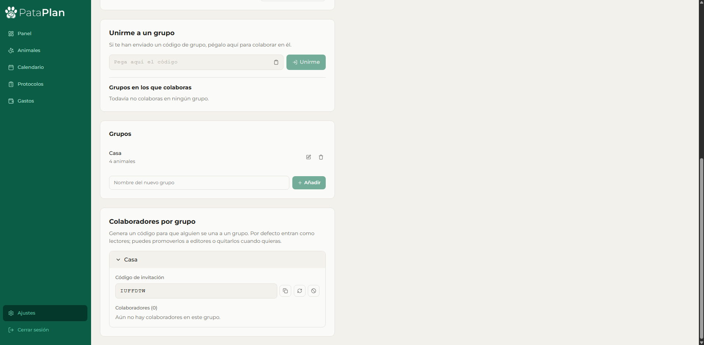

### 9.12.2. Unirse a un grupo con un código

La persona invitada debe:

1. Estar registrada en PataPlan (si no lo está, primero se registra).
2. Ir a **"Grupos"** → **"Unirme con código"**.
3. Pegar el código y pulsar **"Unirme"**.

A partir de ese momento ve los animales del grupo en su panel, con los permisos asignados. Cuando trabaja con animales que no son suyos, la interfaz lo indica claramente con una etiqueta tipo *"de [nombre del propietario]"*.

### 9.12.3. Salir de un grupo

Cualquier colaborador puede **abandonar un grupo** desde sus ajustes en cualquier momento. El administrador del grupo también puede **expulsar** a un colaborador desde la lista de colaboradores del grupo.

## 9.13. Preguntas frecuentes (FAQ)

### 9.13.1. ¿Cómo cambio mi contraseña?

1. Pulsa sobre tu **nombre o foto** en la esquina superior derecha.
2. Entra en **"Ajustes de cuenta"**.
3. En la sección **"Cambiar contraseña"** introduce tu contraseña actual y la nueva (dos veces, para evitar erratas).
4. Pulsa **"Actualizar"**.

Si has olvidado la actual, cierra sesión y usa la opción **"¿Olvidaste tu contraseña?"** en la pantalla de login (ver sección 9.1.4).

### 9.13.2. ¿Cómo elimino un animal?

1. Entra a la **ficha del animal**.
2. Pulsa el botón **"Más opciones"** (icono de tres puntos) en la cabecera.
3. Pulsa **"Eliminar animal"**.
4. Confirma en el cuadro de diálogo que aparece.

> ⚠️ Esta acción **elimina permanentemente** el animal y todo su historial: eventos, visitas, peso, documentos y gastos. Antes de borrar a un animal por una adopción o un traslado, **genera primero su informe PDF** para conservar su historial.

### 9.13.3. ¿Qué pasa si elimino un grupo con animales?

Para evitar pérdidas accidentales, **no se puede eliminar un grupo que aún contiene animales**. Si lo intentas, PataPlan te avisa y te ofrece dos opciones:

- **Mover los animales a otro grupo** antes de borrar.
- **Eliminar los animales uno a uno** desde sus fichas (con los avisos de la pregunta anterior).

Solo cuando el grupo está vacío puedes eliminarlo.

### 9.13.4. ¿Qué diferencia hay entre administrador y colaborador?

- **Administrador**: es el dueño de la cuenta. Puede crear grupos, invitar colaboradores, configurar protocolos, registrar todo tipo de eventos, gestionar gastos y eliminar animales y grupos suyos.
- **Colaborador**: es alguien a quien han invitado a uno o varios grupos. **Solo ve los animales de los grupos a los que pertenece**, no los del resto. Dentro de cada grupo tiene un rol:
  - **Lector**: puede ver toda la información, pero no modificar nada.
  - **Editor**: puede registrar eventos, visitas, pesos y gastos, pero no tocar la configuración del grupo ni invitar a nadie más.

Una misma persona puede tener su propia cuenta de administrador y, a la vez, ser colaborador en grupos de otros usuarios. Por ejemplo, alguien puede ser **administrador** de su grupo "Casa" y a la vez **editor** en el grupo "Refugio" de una protectora.

### 9.13.5. ¿Cómo funciona el orden de alertas del dashboard?

El dashboard no ordena los eventos pendientes por fecha, sino por **urgencia real**. Esto responde a la pregunta: *"¿qué tengo que atender primero?"*.

PataPlan combina tres factores para calcular esa urgencia:

- **Cuánto se ha retrasado el evento**: cuantos más días vencido, más alto sube en la lista.
- **Qué tipo de evento es**: un tratamiento activo pesa más que una desparasitación rutinaria; una vacuna más que una revisión.
- **El estado del animal**: los cachorros (menos de 6 meses) y los recién ingresados (menos de 30 días en el sistema) suben de prioridad porque necesitan más vigilancia.

Por eso, una desparasitación rutinaria atrasada un día en un adulto sano puede aparecer **debajo** de un tratamiento atrasado tres días en un cachorro recién ingresado, aunque la fecha del segundo sea posterior.

### 9.13.6. ¿Puedo usar PataPlan desde el móvil?

Sí. PataPlan es **responsive**: se adapta automáticamente al tamaño de tu pantalla. Desde el móvil puedes registrar pesos, marcar eventos como realizados y consultar el calendario igual que desde el ordenador. Solo algunas tareas más densas, como configurar protocolos o revisar el dashboard económico, son más cómodas en pantalla grande.

### 9.13.7. ¿Cómo cierro sesión?

Pulsa sobre tu **nombre** en la esquina superior derecha y pulsa **"Cerrar sesión"**. Si habías marcado "Mantener sesión iniciada", esto también la borra en este dispositivo.

### 9.13.8. ¿A quién pertenecen mis datos?

Tus datos son tuyos. PataPlan no comparte ni vende información a terceros. Puedes solicitar la **exportación de todos tus datos** (animales, historial, gastos) o la **eliminación completa de tu cuenta** desde "Ajustes de cuenta" → "Privacidad".

---

¿No has encontrado lo que buscabas? Escribe al equipo del proyecto a través del repositorio de GitHub: <https://github.com/jesuuslopeez/pata-plan/issues>.
